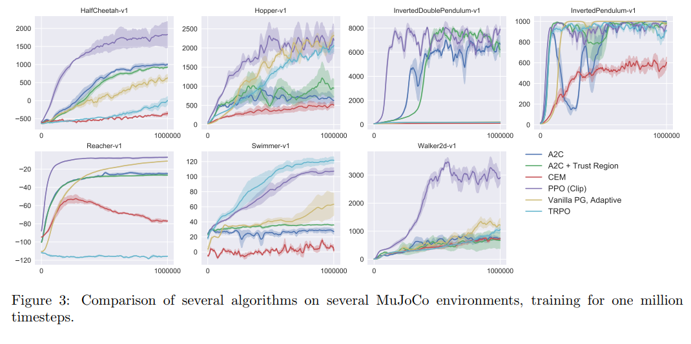
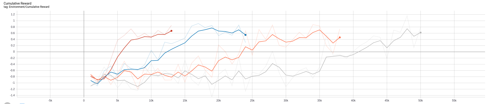
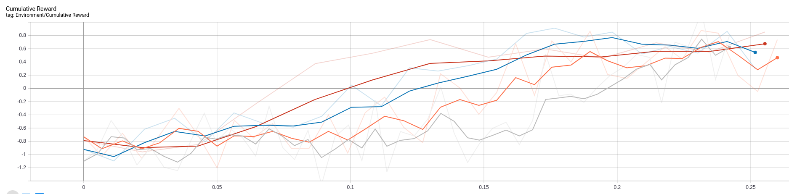
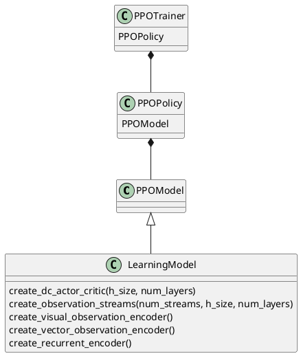

# Modeling

## Select modeling technique
<!---Document the actual modeling technique that is to be used. If multiple
techniques are applied, perform this task separately for each technique.
Many modeling techniques make specific assumptions about the data—for example,
that all attributes have uniform distributions, no missing values allowed,
class attribute must be symbolic, etc. Record any such assumptions made. --->

### State of the art

#### [Andrej Karpathy Deep Reinforcement Learning](http://karpathy.github.io/2016/05/31/rl/)

_May 31, 2016_

>  It turns out that Q-Learning is not a great algorithm (you could say that DQN is so 2013 (okay I’m 50% joking)). In fact most people prefer to use Policy Gradients, including the authors of the original DQN paper who have shown Policy Gradients to work better than Q Learning when tuned well. PG is preferred because it is end-to-end: there’s an explicit policy and a principled approach that directly optimizes the expected reward.

He explains how Policy Gradients works and illustrates it with an example of playing Pong.

#### [Proximal Policy Optimization](https://openai.com/blog/openai-baselines-ppo/)

Publication by OpenAI that explains PPO. This method is used in the examples of AnimalAI challenge. It seems that Policy Gradients are difficult to train and one way to make it easier is to make changes in the weights that do not modify the distribution too much.

It should be implemented in [github](https://github.com/openai/baselines)

#### [Policy Gradient methods and Proximal Policy Optimization (Video)](https://www.youtube.com/watch?v=5P7I-xPq8u8)

Nice video that explains PPO. The plots show that PPO is the best PG method. At the begginning it says that DQN needs less samples than PG, however it also says that PPO is more data efficient.

If I look at the plots I can see that DQN is faster than A2C but PPO is faster than A2C so hopefully PPO and DQN will be of comparable efficiency.

<p align="center">
  
</p>

<p align="center">
  
</p>


#### [Deep Q Network vs Policy Gradients - An Experiment on VizDoom with Keras](https://flyyufelix.github.io/2017/10/12/dqn-vs-pg.html)

> Policy Gradients is generally believed to be able to apply to a wider range of problems. For instance, on occasions when the Q function (i.e. reward function) is too complex to be learned, DQN will fail miserably. On the other hand, Policy Gradients is still capable of learning a good policy since it directly operates in the policy space. Furthermore, Policy Gradients usually show faster convergence rate than DQN, but has a tendency to converge to a local optimal. Since Policy Gradients model probabilities of actions, it is capable of learning stochastic policies, while DQN can’t. Also, Policy Gradients can be easily applied to model continuous action space since the policy network is designed to model probability distribution, on the other hand, DQN has to go through an expensive action discretization process which is undesirable.
You may wonder if there are so many benefits of using Policy Gradients, why don’t we just use Policy Gradients all the time and forget about Q Learning? It turns out that one of the biggest drawbacks of Policy Gradients is the high variance in estimating the gradient of E[R_t]E[R​t]. Essentially, each time we perform a gradient update, we are using an estimation of gradient generated by a series of data points <ss,aa,rr,s^\primes′> accumulated through a single episode of game play. This is known as Monte Carlo method. Hence the estimation can be very noisy, and bad gradient estimate could adversely impact the stability of the learning algorithm. In contrast, when DQN does work, it usually shows a better sample efficiency and more stable performance.

#### [Proximal Policy Optimization (PPO) with Sonic the Hedgehog](https://towardsdatascience.com/proximal-policy-optimization-ppo-with-sonic-the-hedgehog-2-and-3-c9c21dbed5e)

> Some weeks ago, OpenAI made a breakthrough in Deep Reinforcement Learning. They beat some of the best Dota2 players of the world with OpenAI five, a team of 5 agents. Unfortunately, they lost during the second experience.
This breakthrough was made possible thanks to a strong hardware architecture and by using the state of the art’s algorithm: PPO aka Proximal Policy Optimization.

More evidence in favour of PPO.


## Generate test design
<!---Describe the intended plan for training, testing, and evaluating the models.
A primary component of the plan is determining how to divide the available dataset
into training, test, and validation datasets.

Doing a plot of score vs train size could be helpful to decide the validation strategy

Depending on the size of the data we have to decide how we are going to use submissions.
The less the submissions the most confidence we can have on the score. However sometimes
the data distribution is very different, or the size of the data is small and we have
to make a lot of submissions. Sometimes is not easy to have a good correlation between
validation score and LB score
--->

**TODO:**

## Iteration 1. Imitation learning
<!---
The work is done using short iterations. Each iteration needs to have a very
clear goal. This allows to gain greater knowledge of the problem on each iteration.
--->
On the first iteration I want to train an agent by imitating human play. This will allow to create a
baseline that will allow to compare the efficiency of supervised training versus reinforcement learning.

Hopefully this agent will be able to solve many of the challenges that do not require too much intelligence
and that will also give us hints about the difficulty of the tests.

### Goal

* Learn how to train an agent, how to interact with the arena
* Train a baseline agent using imitation learning
* Learn how to make a submission
* Visualize how the agent plays

### Development

#### First submission

I have followed the [instructions](https://github.com/beyretb/AnimalAI-Olympics/blob/master/documentation/submission.md) to make a first submission using the provided agent. The submission involves
creating a docker image with all the dependencies and copying the agent inside it. There is a python script for testing the docker that I believe is very similar to the one used on the challenge.

There is python package called evalai that can be used to upload the docker image to the challenge. The upload speed is about 5 MB/s. It's possible to use that package to get the results of the submission.

I should probably adapt the docker file so I can parametrize the agent script and the data needed.

```bash
cd examples/submission/
docker build --tag=submission .
docker run -v "$PWD"/test_submission:/aaio/test submission python /aaio/test/testDocker.py
evalai push submission:latest --phase animalai-main-396
evalai submission 29473
evalai submission 29473 result
```

#### Recording games

I have created a script that allows to play games using the keyboard and save the information of
the game to disk. This allows to do later supervised learning. The script is located at "scripts/record_games/record_games.py"
and I have prepared a simple instruction on make to record games.

#### Training

I have trained a simple model that uses as input the frame, speed and previous action to predict the next action.
The number of parameters is very small ~ 6k and trains very fast.

I have realized that the games have horizontal simetry so I can duplicate the games by doing an horizontal flip to the images
and inverting the rotations.

#### Visualizing agent play

I also created a quick visualization of the agent play. It needs to be improved in the next iteration.

#### Problems with conda environment

There are inconsistencies between opencv, tensorflow-gpu and the environment requirements (numpy 1.14.5). Maybe I should create an environment for playing an another for training. However if I want to do reinforcement learning I need both in the environment.

Which are my requirements:
* python 3.6, this is required by animalai
* opencv 4.1.0 or higher, previous versions do not show the window
* tensorflow-gpu, needed to train
* numpy 1.14.5, is this really necessary?

I have solved the problme this way:

  conda create -n animal -c conda-forge python=3.6 jupyter ipywidgets pytest rope pylint tqdm pandas scikit-learn ipython ipykernel autopep8 matplotlib tensorflow-gpu opencv==4.1.0 cudatoolkit==10.0.130 numpy==1.14.5 -y
  conda activate animal
  #Install animalai and animalai_train with develop mode: "python setup.py develop"
  python -m ipykernel install --user --name $CONDA_DEFAULT_ENV --display-name "Python ($CONDA_DEFAULT_ENV)"
  pip install evalai

### Results

I will be saving the results of all the models on a [google sheet](https://docs.google.com/spreadsheets/d/15FEKXNcCCVq_YiGFdcpcruGhfKx2oJwzvRT94l4KOUY/edit#gid=0).

I have trained two models:

1. Just with games with a single static food. At the start of the games I rotated always to the same side until I saw food,
then I moved towards the food. The small food is harder to see so I played more games with small food.
2. With lot of games of different categories. I rotated to both sides because I was using mirroring of the games.

The results were surprisingly similar even when the second model was trained with much more data. I get a score of 20.67 and 19 respectively.

My guess is that the "algorithm" that I used for playing was not good for the other categories.
I think that rotating only has sense if the field is empty, otherwise exploration is a better option. If there
are obstacles is better to go to see what's behind them instead of doing a 360 rotation to finally start exploring.
Moreover moving forward at the start of the level may allow to escape from a bouncing bad goal.

### Next steps

* Try playing with a better "algorithm" that explores instead of rotating when there are obstacles
* Prepare a battery of tests that measure how well an agent plays internally
* Create a better visualization algorithm for the agent for better diagnose
* Improve the model architecture and check if better metrics are available
* Create a script for visualizing saved games

## Iteration 2. Improving Imitation Learning results

### Goal

On this iteration I want to lay the foundations for future work.

* Create an script for evaluating the agents
* Create an script for visualizing agents play
* Think of ways of improving the current score by analyzing the already submitted agents

### Development

#### Studying submission test code

The submission test outputs some scores, I want to study the code to see if I can use it as my
evaluation for the agents.

The code is quite simple and I believe I can easily modify it so it will run as many levels as config files it founds.
The scores are reproducible if the number of episodes does not change.

I have prepared a pipeline using the makefile that allows to evaluate a docker and create a summary of all evaluations.

This script could be used to create videos of the games if the agent had opencv. I could create a very similar
script to save the videos, but I don't like the idea of duplicating code and also duplicating the computing
of evaluations. Another alternative would be to save the frames using numpy and later use opencv. I think this
later one is preferable, and I have implemented it.

#### Analyzing previous agents games

Now that I have videos of the agent playing I can analyze them and think ways of improving the model.

##### Best model yet: 003_less_games

* 1_Food. It does not always aim correctly to the food but it is always able to get it.
Sometimes it reaches the borders and rotates to escape from them.
* 2_Preferences. I don't think the preference for yellow balls is clear. Sometimes it collides with red balls.
* 3_Obstacles. Only reaches the food when is visible from the start point. It does not now how to navigate the environment. Many times it gets stuck against the borders of the arena or against walls.
* 4_Avoidance. It has not learn to avoid red zones.
* 5_Spatial Reasoning. It dones not know how to navigate, sometimes it does but not very well. Again aiming
at goals is not very good, sometimes it misses them.
* 6_Generalization. It goes towards green walls, it does not know that only green balls are appealing.
* 7_Internal memory. It seems to keep moving even when the light is off, maybe I have to create an auxiliary function for the agent to stay still when lights are off.
* all_objects_random. It goes towards green walls and wood, collides with a lot of red zones.
* moving_food. Aiming is very bad

##### Model trained with more data: 002_more_games

* 2_Preferences. I don't think the preference for yellow balls is clear
* 4_Avoidence. It does not know to navigate
* 5_Spatial Reasoning. Get's stuck in the borders or walls.

#### New agent

To improve the current agent I want to focus on the following aspects:
* Better aiming at goals. I have seen that current models are not very precise, I want to improve this
* Navigation. To improve the score the model needs to be able to navigate until it sees a clear goal.
* Avoid dead goals and dead zones.
* Improve lightsOff.

I find interesting that even when it seems a simple game and I'm able to solve it defining the strategy
is not clear. So probably reinforcement learning would be the right choice to find the optimal strategy.

To achieve those goals I have to carefully design scenarios that help the agent to learn those concepts.
For example I have the hypothesis that if I start with the dead zones slightly elevated there will be collisions
with the good goals and thus the goals will never be on top of dead zones (Althought it will be interesting to learn
to ignore those goals.)

Another improvement could be to add a HUD overlay over the game that will help to aim correctly at the goal. Also a button to stop the game and save could help to give more weight to certain aspects of the game.

I will solve those problems iteratively, checking that solving one of them does not hurt the others.

##### Better aiming at goals

By using the hud I have played around 57 games and the model seems to be much accurate than previously.

### Results

I have not been able to succesfully train a better agent using supervised learning(or imitation learning).
When I played some levels of one category the score on some other category get worse. Moreover the agent
had some degenerations like going to the border of the arena and staying there.

<p align="center">
  
</p>

I think that the solution has to come from Reinforcement learning. That way the model could escape those
degenerations by itself.

## Iteration 3. Reinforcement learning

### Goal

The goal of the iteration is to take the first steps with reinforcement learning.

On previous iterations we have seen
that it's possible to get a good score by showing a few examples of games played on simple scenarios. It should
be possible to do the same with RL. Moreover by playing on more complex scenarios abilities such as navigation and dead
avoiding should be developed.


### Development

#### Sample training script

On a first step I want to understand and use the sample training script provided on animalai.
I run the script "trainMLAgents.py" as it is and I can see that the usage of cpu and gpu is very small, so I can probably
use more arenas than 4 for training. Moreover the model is using 23 MB of disk space while my first models were only 150-300 kB.

I have trained for 400k steps in 1:40 hours. The model has learned to reach green balls but not small ones. I have to use more data on training.

If I use 16 arenas those which are not configured are loaded randomly. However it seems to be running on a single core so there is no speedup.
I have trained a model with 36 arenas for almost a day and the model is not able to learn anything.

I'm going to try to train a model on very simple arenas with just goals, to try to reach a similar score to the one I get with supervised learning.
The model is able to learn to reach big goals but not small ones. I have been digging into animalai_train code and I have found where the model
is defined and I have modified the architecture.

Let's try to summarize the learnings:
* Training uses only 1 core and the gpu is almost idle. Being able to speedup this would give a great advantage over competitors.
* The animalai_train repo seems to be a copy from ml-agents. There is a lot of code but probably most of it is just copied.
* The model used by the train script is hardcoded on the library and defined on tensorflow. Is defined on LearningModel class
* Looking at the source code it seems that it only uses visual input, there are some functions about vector observations but I think
they are not being used.
* It's possible to resume the training
* Tensorboard is useful to analize the train evolution.

#### Multicore training

https://github.com/Unity-Technologies/ml-agents/issues/828
https://github.com/Unity-Technologies/ml-agents/issues/1441
https://github.com/Unity-Technologies/ml-agents/issues/209

https://github.com/Unity-Technologies/ml-agents/blob/master/docs/Training-ML-Agents.md
--num-envs=<n> - Specifies the number of concurrent Unity environment instances to collect experiences from when training. Defaults to 1.

https://github.com/Unity-Technologies/ml-agents/blob/master/ml-agents/mlagents/trainers/learn.py
env = SubprocessUnityEnvironment(env_factory, num_envs)  This seems to hold the key to do multicore training.

I have tried importing "from mlagents.envs.subprocess_environment import SubprocessUnityEnvironment" but there are conflicts with animalai.
Maybe I should copy that into animalai.

  TypeError: Couldn't build proto file into descriptor pool!
  Invalid proto descriptor for file "mlagents/envs/communicator_objects/agent_action_proto.proto":
  communicator_objects.AgentActionProto.vector_actions: "communicator_objects.AgentActionProto.vector_actions" is already defined in file "animalai/communicator_objects/agent_action_proto.proto".
  communicator_objects.AgentActionProto.text_actions: "communicator_objects.AgentActionProto.text_actions" is already defined in file "animalai/communicator_objects/agent_action_proto.proto".
  communicator_objects.AgentActionProto.memories: "communicator_objects.AgentActionProto.memories" is already defined in file "animalai/communicator_objects/agent_action_proto.proto".
  communicator_objects.AgentActionProto.value: "communicator_objects.AgentActionProto.value" is already defined in file "animalai/communicator_objects/agent_action_proto.proto".
  communicator_objects.AgentActionProto: "communicator_objects.AgentActionProto" is already defined in file "animalai/communicator_objects/agent_action_proto.proto".

I'm trying to implement the SubprocessUnityEnvironment on Animalai. At this moment I'm able to create n environments, reset them and send actions.
It runs on multicore but it is not moving and the actions have a strange format. So I have to fix that, but it seems to be at reach. I should look
at animalai/animalai/envs/subprocess_environment.py and animalai/animalai/envs/environment.py because they must share the same interface to be able to use them.
Also check external_brain_names because that might be a problem also because of poor implementation.

I have solved the problem of input to the environment, however now I need some parameters for training and the process hangs when requesting them.
I should try to simplify the problem as maximum as possible and think how to solve. Autoreload on python could help.

I'm almost there, I think I have to modify the brain parameters to match the number of observations and it should be done.

I have made 4 short trainings with 1, 2, 4 and 8 environments. The results clearly show that the training has speedup. The first one has the number of steps in the horizontal axis and cumulative reward in the vertical axis.
The second one has training time in hours on horizontal axis.

<p align="center">
  
</p>

<p align="center">
  
</p>

#### Better models and input

Now that I have optimized the training speed I want to check which input is being used currently for the model.
I want to feed the speed and previous action just like I did on my supervised learning trainings.
I also want to have an easy way of modifying the model.

To do this I can read the animalai_train code, also ml-agents might help and I can add prints to get more information
of the current model. From the fast read of the past days I believe that the current model only uses pixels.

The animalai_train library is a copy of [ml-agents](https://github.com/Unity-Technologies/ml-agents/tree/master/ml-agents/mlagents/trainers).
It has exactly the same structure. Below there is an scheme of the classes used for training.



So the model is defined on the class LearningModel. I have seen that if setting the parameter use_recurrent=True then the previous
action is used as input. Thus I have decided to use that option with a small memory.

When using the model for prediction the behaviour is not very good. The score is 0.68, but I think
this may be caused by not resetting the memory of the agent. However I cannot find information so I'm not sure about that.

When trying to understand the bad score I have realised that the models trained with ml-agents are not deterministic while
the models trained with supervised learning are. I have found a bug in the test script that did not end the levels and was causing problems.
After this fix the score raises to 0.93 but it is still not deterministic, on forcedChoice the scores change when the level is the same. So this
seems to be a problem of the agent.
I have dig to the code and I have found that the action is computed by sampling over logprobabilities predicted by the agent. This explains why
some of the agents like 006 are not repetitive on forcedChoice level. One option is to take the action with max value instead of sampling.
I have tried with that and the score improves to 1.13 from 0.93 so that is a good improvement. The agent is quite good except that sometimes enters
in a stuck mode. But it has learnt to avoid red goals. More important the score on forcedChoice is constant.

#### Better navigation

It seems that the training_002 configuration is already learned. Now I want to expand that configuration to better learn to navigate
while don't forgetting the basic things. So I have added 16 additional arenas up to 32 to try to learn navigation and avoiding. The results are on
the agent 010_avoid_and_navigation_max_action. Even with this better configuration the model does not learn to navigate.

To try to improve the navigation I'm going to increase the memory of the agent from 4 to 32 frames.
The training metrics are very similar to previous trainings. When testing the results are better but it moves backwards sometimes
without any sense and gets stuck and bounces from left to right. However 011_more_memory_max_action achieves the best test score until now.

I'm going to try using 128 frames to see if those bounces dissapear. Also duplicate memory size from 64 to 128.
The metrics are quite similar so I have decided to drop beta from 1e-2 to 1e-3 (step=36.5k). After doing this I can see a clearly drop on entropy.
On epoch 53k I decrease beta even more to 1e-4. With this changes entropy decreases to 0.5 while on the previous trainings the smaller value was close
to one. However the cumulative reward does not improve.
Decreasing the learning rate does not improve the cumulative reward either.
This agent keeps also bouncing and does not seem to navigate well, it moves backwards without any sense.
So increasing the memory, the number of frames, decreasing beta and decreasing learning rate did not improve the agent.

#### Ideas for improving

I'm reading MLAgents documentation and below there is a list of ideas for improving the agents:

* Decrease learning rate
* Decrease beta, which controls how random the actions are
* Increase the time horizon just in case
* Increase the model capacity
* Modify the visual encoder, it would be nice to be able to parametrize it
* Analyze the tensorboard plots and adjust the parameters
* Increase episode duration to give time to a random object to reach the target
* Remove the option to go backwards.

#### More length and going backwards

After trying with learning rate and memory without much success I have two ways of improving. The first one
is to extend the length of the episodes so the agent has more time to reach the targets.
The second one is to modify the code so the agent can never go backwards, which is an undesired behaviour at
this step of the game.

On a first step I increase the duration of the episodes to 500

On a second step I have found that the variable vector_action_space_size inside the brain has a size of [3, 3].
If I modify it to be [2, 3] that would be enough. Another option is make the agent ignore the moving backwards. I have tried to modify
the agent to ignore moving backwards and it improves slighlty but not too much. Probably it needs to be trained that way.

By looking at the code one option is to modify the create_discrete_action_masking_layer function on models.py.
Another is to modify the update function of the policy that creates tha t: 500. I can use that mask to avoid moving backwards or even stop.
Let's try to train an agent that always moves forward, that will reduce the search space by 1/3.

The agent that always moves forward has problems with the borders and sometimes gets stuck on them. It also has some problems when catching
the goals because of moving too fast.

I have trained two new models that never go backwards. However it does not seem that they have learned to navigate correctly.
It seems that adding more capacity to the network helped but not too much.

#### RAM Usage

I have found that certain trainings use a lot of RAM memory. I want to understand which parameters affect to RAM usage.

* The RAM usage is proportional to the number of environments running.
* The RAM usage is proportional to the length of the episode
* The buffer size has also a great influence in the RAM usage. But sometimes more data
than the buffer size can get accumulated, for example at the start of the training. I think it is
related to the number of environments, number of arenas and training of the model.
* memory_size and sequence_length have small influence on RAM usage
* Using a pretrained model modifies the RAM usage at the start of the training because not a lot of episodes acumulate when the time runs out. But the RAM eventuallyl increases.

| n_env 	| buffer_size 	| episode_t 	| memory_size 	| sequence_length 	| mask 	| retrain 	| RAM (GB) 	| RAM 2(GB) 	| RAM 3(GB) 	|
|-------	|-------------	|-----------	|-------------	|-----------------	|------	|---------	|----------	|-----------	|-----------	|
| 4     	| 1024        	| 500       	| 64          	| 32              	| 2    	| N       	| 28       	| 26.5      	| 25.5      	|
| 2     	| 1024        	| 500       	| 64          	| 32              	| 2    	| N       	| 15.2     	| 13.9      	|           	|
| 1     	| 1024        	| 500       	| 64          	| 32              	| 2    	| N       	| 8.4      	|           	|           	|
| 6     	| 1024        	| 500       	| 64          	| 32              	| 2    	| N       	| 41       	|           	|           	|
|       	|             	|           	|             	|                 	|      	|         	|          	|           	|           	|
| 2     	| 1024        	| 250       	| 64          	| 32              	| 2    	| N       	| 8        	|           	|           	|
| 4     	| 1024        	| 250       	| 64          	| 32              	| 2    	| N       	| 15       	|           	|           	|
|       	|             	|           	|             	|                 	|      	|         	|          	|           	|           	|
| 2     	| 2048        	| 250       	| 64          	| 32              	| 2    	| N       	| 8        	|           	|           	|
| 2     	| 8192        	| 250       	| 64          	| 32              	| 2    	| N       	| 8.5      	|           	|           	|
| 2     	| 16384       	| 250       	| 64          	| 32              	| 2    	| N       	| 15.6     	|           	|           	|
| 2     	| 32768       	| 250       	| 64          	| 32              	| 2    	| N       	| 16.9     	|           	|           	|
| 2     	| 65536       	| 250       	| 64          	| 32              	| 2    	| N       	| 26.9     	|           	|           	|
|       	|             	|           	|             	|                 	|      	|         	|          	|           	|           	|
| 2     	| 8192        	| 250       	| 64          	| 32              	| 2    	| N       	| 8.5      	|           	|           	|
| 2     	| 8192        	| 250       	| 64          	| 4               	| 2    	| N       	| 8.5      	|           	|           	|
| 2     	| 8192        	| 250       	| 64          	| 128             	| 2    	| N       	| 8.6      	|           	|           	|
| 2     	| 8192        	| 250       	| 64          	| 256             	| 2    	| N       	| 8.8      	|           	|           	|
| 2     	| 8192        	| 250       	| 128         	| 256             	| 2    	| N       	| 9.1      	|           	|           	|
| 2     	| 8192        	| 250       	| 256         	| 256             	| 2    	| N       	| 9.1      	|           	|           	|
| 2     	| 8192        	| 250       	| 512         	| 256             	| 2    	| N       	| 9.1      	|           	|           	|
|       	|             	|           	|             	|                 	|      	|         	|          	|           	|           	|
| 2     	| 8192        	| 250       	| 64          	| 32              	| 2    	| N       	| 8.3      	|           	|           	|
| 4     	| 8192        	| 250       	| 64          	| 32              	| 2    	| N       	| 15.7     	|           	|           	|
| 4     	| 8192        	| 250       	| 64          	| 32              	| 2    	| Y       	| 7.6      	| 9.3       	| 10.8      	|
| 8     	| 8192        	| 250       	| 64          	| 32              	| 2    	| N       	| 29.3     	|           	|           	|
| 8     	| 8192        	| 250       	| 64          	| 32              	| 2    	| Y       	| 9        	| 10.7      	| 12.3      	|

#### Relation between n_envs, n_arenas, t and buffer_size

After the experiments of RAM usage I come to the conclusion that there is a relation between the following parameters.

'''
n_envs * n_arenas * t = buffer_size * alpha
'''

It does not have sense to increase the n_envs if the buffer size remains constant. I believe that alpha should be bigger than 1, probably two is a good choice.

| n_envs 	| n_arenas 	| t   	| product 	| buffer_size 	| RAM (GB)                         	|
|--------	|----------	|-----	|---------	|-------------	|----------------------------------	|
| 2      	| 32       	| 250 	| 16000   	| 32768       	| 17.2, 17.1, 15.2                 	|
| 2      	| 32       	| 250 	| 16000   	| 8192        	| 8.3, 9.7, 12.1, 7.8, 11.6, 8.7   	|
| 8      	| 16       	| 250 	| 32000   	| 65536       	| 27.2                             	|
| 4      	| 32       	| 250 	| 32000   	| 65536       	| 33                               	|
| 6      	| 32       	| 250 	|         	| 65536       	| 38                               	|

#### CPU Usage

I have found that the cpu is never fully used. Let's try to understand why.

The bigger the number of envs the more the cpu usage but it peaks around 5 envs.

| n_envs 	| n_arenas 	| n_trains 	| cpu (%) 	|
|--------	|----------	|----------	|---------	|
| 1      	| 32       	| 1        	| 20      	|
| 2      	| 32       	| 1        	| 33      	|
| 3      	| 32       	| 1        	| 40      	|
| 4      	| 32       	| 1        	| 48      	|
| 5      	| 32       	| 1        	| 55      	|
| 6      	| 32       	| 1        	| 56      	|
| 8      	| 32       	| 1        	| 58      	|
| 16     	| 32       	| 1        	| ~50     	|

It seems that the number of arenas does not affect cpu usage. However it affects to
game speed.

| n_envs 	| n_arenas 	| n_trains 	| cpu (%) 	|
|--------	|----------	|----------	|---------	|
| 4      	| 32       	| 1        	| 48      	|
| 4      	| 16       	| 1        	| 48      	|
| 4      	| 8        	| 1        	| 48      	|
| 4      	| 4        	| 1        	| 48      	|
| 4      	| 2        	| 1        	| 44      	|
| 4      	| 1        	| 1        	| 44      	|
| 8      	| 1        	| 1        	| 58      	|

Running more than one train at ta time can increase the cpu usage.

| n_envs 	| n_arenas 	| n_trains 	| cpu (%) 	|
|--------	|----------	|----------	|---------	|
| 4      	| 1        	| 1        	| 44      	|
| 4      	| 1        	| 2        	| 68      	|
| 4      	| 1        	| 3        	| 80      	|

#### Simulation speed

I want to measure how the simulation speeds varies with the number of environments and the number of arenas.
For doing that I will record the logging times and compute differences.
The results have been saved in this [google sheet](https://docs.google.com/spreadsheets/d/15FEKXNcCCVq_YiGFdcpcruGhfKx2oJwzvRT94l4KOUY/edit#gid=454246532).

The conclusion is that using multiple environments increments the throughput, but the max gain is x2.
Moreover it seems that using between 16 and 32 arenas is the best option. However the differences are small.
So probably RAM requirements would be more important.

#### Increasing model capacity

I'm going to increase the capacity of the visual encoding, and hopefully made that customizable. Maybe that could allow
to improve the agent scores. Below there is a list of the dependencies from lower to higher level. I can use it to
pass new parameters to the model.

```
trainers.LearningModel.create_visual_observation_encoder
trainers.LearningModel.create_observation_streams
trainers.ppo.PPOModel.create_dc_actor_critic, create_curiosity_encoders
trainers.ppo.PPOPolicy(trainer_params)
trainers.ppo.PPOTrainer(trainer_params)
trainers.TrainerController.start_learning(trainer_config)
```

My first idea is to pass a list with the number of kernels for each convolution. I will encapsulate this
into a dictionary called visual_encoding so I can later extend this.
Previously I was using kernels [8, 8, 16, 16] and the model weighted 9 MB.
If I use [8, 16, 32, 64] the model uses now TODO:
If using [16, 16, 32, 32] the weight is 

#### Multiple configuration files

Using different configuration files on the different environments could allow to reduce the number of arenas or 
to make a more diverse training. I have been looking at the code and I think it could be as easy as passing a list of
ArenaConfigs and modifying the broadcast on reset function on subprocess_environment.

```python
self._broadcast_message("reset", (config, train_mode))
```

```python
if isinstance(config, list):
  for idx, env in enumerate(self.envs):
    env.send("reset", (config[idx % len(config)], train_mode))
else:
  self._broadcast_message("reset", (config, train_mode))
```

### Results

I have trained the agent 006_ml_agents_first_steps with a simplified architecture and simple arenas. It has reached
a score of 24 which is slightly better than my best model with supervised learning.

I have trained a second agent 007_ml_agents_first_steps that has 16 arenas for playing. It has been trained with "data/env_configs/training_002.yaml".
It achieves a score of 23, improving on some categories and worsening on others. I have the intuition that the model needs more inputs and that will
simplify the game so it can focus on learning new behaviours.

I have trained a new model 008_multicore using the the multicore environment. I have double the batch size and also increased the buffer size more than x10.
(batch_size: 128, buffer_size: 32768), hopefully this will allow to better capture the game dynamics. The agent looks good, the best until now but I don't like that
it moves backwards many times when that is dangerous.

The model 009_recurrent_max_action achieves a score of 25.33
The model 010_avoid_and_navigation_max_action achieves 25.67. However even that its name says that it does not know how to navigate.
Many times it falls in loops bouncing looking right and left without doing anything, maybe it needs more memory.
Neither it knows how to navigate avoiding the dead zones.

The model 011_more_memory_max_action achieves a score of 29 and surpases the hand-coded baseline. However it does not navigate
correctly yet.

The model 012_even_more_memory_max_action achieves a score of 31.33

The model 014_always_forward achieves a score of 24

The model 016_never_backward_more_capacity_max_action achieves a score of 28.67

I have the feeling that the scores of the current agents are somehow random.

The agent 017_never_backward_more_capacity_max_action achieves the best score of 31.68 just by
training for more time the 016 agent with a bigger buffer size. This probes that not moving backward
can be a good choice. However good navigations is still not achieved.

TODO: models with more capacity results

### Conclusions

* We have been able to improve the LB score from 23.67 to 31.67 by using RL instead of supervised learning
* We have implemented a multicore arena training
* We have made experiments to understand RAM and CPU usage
* The model visual encoding architecture has been parametrized
* Multiple arena configurations are allowed for training
* I have more knowledge about the model and the game after this iteration
* Navigation and avoiding red zones is not a solved problem yet
* There seems to be a limit in the score when training with the current arenas configuration

## Iteration 4. Focus on navigation

### Goal

On this iteration we are going to train a model using RL focusing on navigation. I will train
on the level 5-SpatialReasoning and see which results I get.
We have not seen yet an agent with good navigation skills, hopefully this simplified experiment
will give useful information about training parameters and model architecture.

### Development

The configuration for SpatialReasoning has two GoodGoalMulti of size 1, so the max reward for that
level is 2. However considering that navigation should be done to gather them we can consider a good result
when the reward is above 1, that means that the two goals were collected.

### Results


<!---
## Iteration n. Iteration_title

### Goal

### Development

### Results
--->