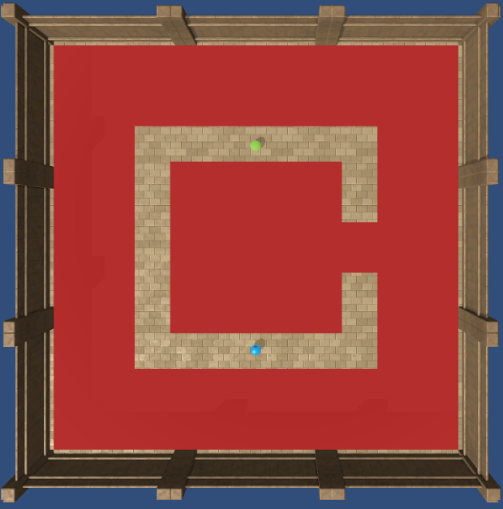
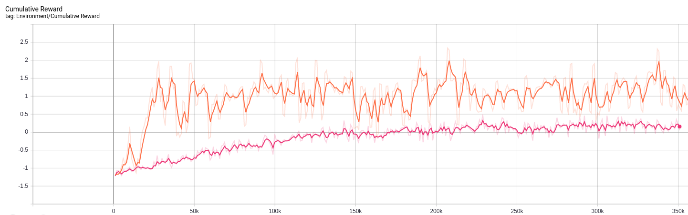

# Modeling

## Select modeling technique
<!---Document the actual modeling technique that is to be used. If multiple
techniques are applied, perform this task separately for each technique.
Many modeling techniques make specific assumptions about the data—for example,
that all attributes have uniform distributions, no missing values allowed,
class attribute must be symbolic, etc. Record any such assumptions made. --->

### State of the art

#### [Andrej Karpathy Deep Reinforcement Learning](http://karpathy.github.io/2016/05/31/rl/)

_May 31, 2016_

>  It turns out that Q-Learning is not a great algorithm (you could say that DQN is so 2013 (okay I’m 50% joking)). In fact most people prefer to use Policy Gradients, including the authors of the original DQN paper who have shown Policy Gradients to work better than Q Learning when tuned well. PG is preferred because it is end-to-end: there’s an explicit policy and a principled approach that directly optimizes the expected reward.

He explains how Policy Gradients works and illustrates it with an example of playing Pong.

#### [Proximal Policy Optimization](https://openai.com/blog/openai-baselines-ppo/)

Publication by OpenAI that explains PPO. This method is used in the examples of AnimalAI challenge. It seems that Policy Gradients are difficult to train and one way to make it easier is to make changes in the weights that do not modify the distribution too much.

It should be implemented in [github](https://github.com/openai/baselines)

#### [Policy Gradient methods and Proximal Policy Optimization (Video)](https://www.youtube.com/watch?v=5P7I-xPq8u8)

Nice video that explains PPO. The plots show that PPO is the best PG method. At the begginning it says that DQN needs less samples than PG, however it also says that PPO is more data efficient.

If I look at the plots I can see that DQN is faster than A2C but PPO is faster than A2C so hopefully PPO and DQN will be of comparable efficiency.

<p align="center">
  
</p>

<p align="center">
  
</p>


#### [Deep Q Network vs Policy Gradients - An Experiment on VizDoom with Keras](https://flyyufelix.github.io/2017/10/12/dqn-vs-pg.html)

> Policy Gradients is generally believed to be able to apply to a wider range of problems. For instance, on occasions when the Q function (i.e. reward function) is too complex to be learned, DQN will fail miserably. On the other hand, Policy Gradients is still capable of learning a good policy since it directly operates in the policy space. Furthermore, Policy Gradients usually show faster convergence rate than DQN, but has a tendency to converge to a local optimal. Since Policy Gradients model probabilities of actions, it is capable of learning stochastic policies, while DQN can’t. Also, Policy Gradients can be easily applied to model continuous action space since the policy network is designed to model probability distribution, on the other hand, DQN has to go through an expensive action discretization process which is undesirable.
You may wonder if there are so many benefits of using Policy Gradients, why don’t we just use Policy Gradients all the time and forget about Q Learning? It turns out that one of the biggest drawbacks of Policy Gradients is the high variance in estimating the gradient of E[R_t]E[R​t]. Essentially, each time we perform a gradient update, we are using an estimation of gradient generated by a series of data points <ss,aa,rr,s^\primes′> accumulated through a single episode of game play. This is known as Monte Carlo method. Hence the estimation can be very noisy, and bad gradient estimate could adversely impact the stability of the learning algorithm. In contrast, when DQN does work, it usually shows a better sample efficiency and more stable performance.

#### [Proximal Policy Optimization (PPO) with Sonic the Hedgehog](https://towardsdatascience.com/proximal-policy-optimization-ppo-with-sonic-the-hedgehog-2-and-3-c9c21dbed5e)

> Some weeks ago, OpenAI made a breakthrough in Deep Reinforcement Learning. They beat some of the best Dota2 players of the world with OpenAI five, a team of 5 agents. Unfortunately, they lost during the second experience.
This breakthrough was made possible thanks to a strong hardware architecture and by using the state of the art’s algorithm: PPO aka Proximal Policy Optimization.

More evidence in favour of PPO.


## Generate test design
<!---Describe the intended plan for training, testing, and evaluating the models.
A primary component of the plan is determining how to divide the available dataset
into training, test, and validation datasets.

Doing a plot of score vs train size could be helpful to decide the validation strategy

Depending on the size of the data we have to decide how we are going to use submissions.
The less the submissions the most confidence we can have on the score. However sometimes
the data distribution is very different, or the size of the data is small and we have
to make a lot of submissions. Sometimes is not easy to have a good correlation between
validation score and LB score
--->

**TODO:**

## Iteration 1. Imitation learning
<!---
The work is done using short iterations. Each iteration needs to have a very
clear goal. This allows to gain greater knowledge of the problem on each iteration.
--->
On the first iteration I want to train an agent by imitating human play. This will allow to create a
baseline that will allow to compare the efficiency of supervised training versus reinforcement learning.

Hopefully this agent will be able to solve many of the challenges that do not require too much intelligence
and that will also give us hints about the difficulty of the tests.

### Goal

* Learn how to train an agent, how to interact with the arena
* Train a baseline agent using imitation learning
* Learn how to make a submission
* Visualize how the agent plays

### Development

#### First submission

I have followed the [instructions](https://github.com/beyretb/AnimalAI-Olympics/blob/master/documentation/submission.md) to make a first submission using the provided agent. The submission involves
creating a docker image with all the dependencies and copying the agent inside it. There is a python script for testing the docker that I believe is very similar to the one used on the challenge.

There is python package called evalai that can be used to upload the docker image to the challenge. The upload speed is about 5 MB/s. It's possible to use that package to get the results of the submission.

I should probably adapt the docker file so I can parametrize the agent script and the data needed.

```bash
cd examples/submission/
docker build --tag=submission .
docker run -v "$PWD"/test_submission:/aaio/test submission python /aaio/test/testDocker.py
evalai push submission:latest --phase animalai-main-396
evalai submission 29473
evalai submission 29473 result
```

#### Recording games

I have created a script that allows to play games using the keyboard and save the information of
the game to disk. This allows to do later supervised learning. The script is located at "scripts/record_games/record_games.py"
and I have prepared a simple instruction on make to record games.

#### Training

I have trained a simple model that uses as input the frame, speed and previous action to predict the next action.
The number of parameters is very small ~ 6k and trains very fast.

I have realized that the games have horizontal simetry so I can duplicate the games by doing an horizontal flip to the images
and inverting the rotations.

#### Visualizing agent play

I also created a quick visualization of the agent play. It needs to be improved in the next iteration.

#### Problems with conda environment

There are inconsistencies between opencv, tensorflow-gpu and the environment requirements (numpy 1.14.5). Maybe I should create an environment for playing an another for training. However if I want to do reinforcement learning I need both in the environment.

Which are my requirements:
* python 3.6, this is required by animalai
* opencv 4.1.0 or higher, previous versions do not show the window
* tensorflow-gpu, needed to train
* numpy 1.14.5, is this really necessary?

I have solved the problme this way:

```bash
conda create -n animal -c conda-forge python=3.6 jupyter ipywidgets pytest rope pylint tqdm pandas scikit-learn ipython ipykernel autopep8 matplotlib tensorflow-gpu opencv==4.1.0 cudatoolkit==10.0.130 numpy==1.14.5 -y
conda activate animal
#Install animalai and animalai_train with develop mode: "python setup.py develop"
python -m ipykernel install --user --name $CONDA_DEFAULT_ENV --display-name "Python ($CONDA_DEFAULT_ENV)"
pip install evalai
```

### Results

I will be saving the results of all the models on a [google sheet](https://docs.google.com/spreadsheets/d/15FEKXNcCCVq_YiGFdcpcruGhfKx2oJwzvRT94l4KOUY/edit#gid=0).

I have trained two models:

1. Just with games with a single static food. At the start of the games I rotated always to the same side until I saw food,
then I moved towards the food. The small food is harder to see so I played more games with small food.
2. With lot of games of different categories. I rotated to both sides because I was using mirroring of the games.

The results were surprisingly similar even when the second model was trained with much more data. I get a score of 20.67 and 19 respectively.

My guess is that the "algorithm" that I used for playing was not good for the other categories.
I think that rotating only has sense if the field is empty, otherwise exploration is a better option. If there
are obstacles is better to go to see what's behind them instead of doing a 360 rotation to finally start exploring.
Moreover moving forward at the start of the level may allow to escape from a bouncing bad goal.

### Next steps

* Try playing with a better "algorithm" that explores instead of rotating when there are obstacles
* Prepare a battery of tests that measure how well an agent plays internally
* Create a better visualization algorithm for the agent for better diagnose
* Improve the model architecture and check if better metrics are available
* Create a script for visualizing saved games

## Iteration 2. Improving Imitation Learning results

### Goal

On this iteration I want to lay the foundations for future work.

* Create an script for evaluating the agents
* Create an script for visualizing agents play
* Think of ways of improving the current score by analyzing the already submitted agents

### Development

#### Studying submission test code

The submission test outputs some scores, I want to study the code to see if I can use it as my
evaluation for the agents.

The code is quite simple and I believe I can easily modify it so it will run as many levels as config files it founds.
The scores are reproducible if the number of episodes does not change.

I have prepared a pipeline using the makefile that allows to evaluate a docker and create a summary of all evaluations.

This script could be used to create videos of the games if the agent had opencv. I could create a very similar
script to save the videos, but I don't like the idea of duplicating code and also duplicating the computing
of evaluations. Another alternative would be to save the frames using numpy and later use opencv. I think this
later one is preferable, and I have implemented it.

#### Analyzing previous agents games

Now that I have videos of the agent playing I can analyze them and think ways of improving the model.

##### Best model yet: 003_less_games

* 1_Food. It does not always aim correctly to the food but it is always able to get it.
Sometimes it reaches the borders and rotates to escape from them.
* 2_Preferences. I don't think the preference for yellow balls is clear. Sometimes it collides with red balls.
* 3_Obstacles. Only reaches the food when is visible from the start point. It does not now how to navigate the environment. Many times it gets stuck against the borders of the arena or against walls.
* 4_Avoidance. It has not learn to avoid red zones.
* 5_Spatial Reasoning. It dones not know how to navigate, sometimes it does but not very well. Again aiming
at goals is not very good, sometimes it misses them.
* 6_Generalization. It goes towards green walls, it does not know that only green balls are appealing.
* 7_Internal memory. It seems to keep moving even when the light is off, maybe I have to create an auxiliary function for the agent to stay still when lights are off.
* all_objects_random. It goes towards green walls and wood, collides with a lot of red zones.
* moving_food. Aiming is very bad

##### Model trained with more data: 002_more_games

* 2_Preferences. I don't think the preference for yellow balls is clear
* 4_Avoidence. It does not know to navigate
* 5_Spatial Reasoning. Get's stuck in the borders or walls.

#### New agent

To improve the current agent I want to focus on the following aspects:
* Better aiming at goals. I have seen that current models are not very precise, I want to improve this
* Navigation. To improve the score the model needs to be able to navigate until it sees a clear goal.
* Avoid dead goals and dead zones.
* Improve lightsOff.

I find interesting that even when it seems a simple game and I'm able to solve it defining the strategy
is not clear. So probably reinforcement learning would be the right choice to find the optimal strategy.

To achieve those goals I have to carefully design scenarios that help the agent to learn those concepts.
For example I have the hypothesis that if I start with the dead zones slightly elevated there will be collisions
with the good goals and thus the goals will never be on top of dead zones (Althought it will be interesting to learn
to ignore those goals.)

Another improvement could be to add a HUD overlay over the game that will help to aim correctly at the goal. Also a button to stop the game and save could help to give more weight to certain aspects of the game.

I will solve those problems iteratively, checking that solving one of them does not hurt the others.

##### Better aiming at goals

By using the hud I have played around 57 games and the model seems to be much accurate than previously.

### Results

I have not been able to succesfully train a better agent using supervised learning(or imitation learning).
When I played some levels of one category the score on some other category get worse. Moreover the agent
had some degenerations like going to the border of the arena and staying there.

<p align="center">
  
</p>

I think that the solution has to come from Reinforcement learning. That way the model could escape those
degenerations by itself.

## Iteration 3. Reinforcement learning

### Goal

The goal of the iteration is to take the first steps with reinforcement learning.

On previous iterations we have seen
that it's possible to get a good score by showing a few examples of games played on simple scenarios. It should
be possible to do the same with RL. Moreover by playing on more complex scenarios abilities such as navigation and dead
avoiding should be developed.


### Development

#### Sample training script

On a first step I want to understand and use the sample training script provided on animalai.
I run the script "trainMLAgents.py" as it is and I can see that the usage of cpu and gpu is very small, so I can probably
use more arenas than 4 for training. Moreover the model is using 23 MB of disk space while my first models were only 150-300 kB.

I have trained for 400k steps in 1:40 hours. The model has learned to reach green balls but not small ones. I have to use more data on training.

If I use 16 arenas those which are not configured are loaded randomly. However it seems to be running on a single core so there is no speedup.
I have trained a model with 36 arenas for almost a day and the model is not able to learn anything.

I'm going to try to train a model on very simple arenas with just goals, to try to reach a similar score to the one I get with supervised learning.
The model is able to learn to reach big goals but not small ones. I have been digging into animalai_train code and I have found where the model
is defined and I have modified the architecture.

Let's try to summarize the learnings:
* Training uses only 1 core and the gpu is almost idle. Being able to speedup this would give a great advantage over competitors.
* The animalai_train repo seems to be a copy from ml-agents. There is a lot of code but probably most of it is just copied.
* The model used by the train script is hardcoded on the library and defined on tensorflow. Is defined on LearningModel class
* Looking at the source code it seems that it only uses visual input, there are some functions about vector observations but I think
they are not being used.
* It's possible to resume the training
* Tensorboard is useful to analize the train evolution.

#### Multicore training

https://github.com/Unity-Technologies/ml-agents/issues/828
https://github.com/Unity-Technologies/ml-agents/issues/1441
https://github.com/Unity-Technologies/ml-agents/issues/209

https://github.com/Unity-Technologies/ml-agents/blob/master/docs/Training-ML-Agents.md
--num-envs=<n> - Specifies the number of concurrent Unity environment instances to collect experiences from when training. Defaults to 1.

https://github.com/Unity-Technologies/ml-agents/blob/master/ml-agents/mlagents/trainers/learn.py
env = SubprocessUnityEnvironment(env_factory, num_envs)  This seems to hold the key to do multicore training.

I have tried importing "from mlagents.envs.subprocess_environment import SubprocessUnityEnvironment" but there are conflicts with animalai.
Maybe I should copy that into animalai.

```
TypeError: Couldn't build proto file into descriptor pool!
Invalid proto descriptor for file "mlagents/envs/communicator_objects/agent_action_proto.proto":
communicator_objects.AgentActionProto.vector_actions: "communicator_objects.AgentActionProto.vector_actions" is already defined in file "animalai/communicator_objects/agent_action_proto.proto".
communicator_objects.AgentActionProto.text_actions: "communicator_objects.AgentActionProto.text_actions" is already defined in file "animalai/communicator_objects/agent_action_proto.proto".
communicator_objects.AgentActionProto.memories: "communicator_objects.AgentActionProto.memories" is already defined in file "animalai/communicator_objects/agent_action_proto.proto".
communicator_objects.AgentActionProto.value: "communicator_objects.AgentActionProto.value" is already defined in file "animalai/communicator_objects/agent_action_proto.proto".
communicator_objects.AgentActionProto: "communicator_objects.AgentActionProto" is already defined in file "animalai/communicator_objects/agent_action_proto.proto".
```

I'm trying to implement the SubprocessUnityEnvironment on Animalai. At this moment I'm able to create n environments, reset them and send actions.
It runs on multicore but it is not moving and the actions have a strange format. So I have to fix that, but it seems to be at reach. I should look
at animalai/animalai/envs/subprocess_environment.py and animalai/animalai/envs/environment.py because they must share the same interface to be able to use them.
Also check external_brain_names because that might be a problem also because of poor implementation.

I have solved the problem of input to the environment, however now I need some parameters for training and the process hangs when requesting them.
I should try to simplify the problem as maximum as possible and think how to solve. Autoreload on python could help.

I'm almost there, I think I have to modify the brain parameters to match the number of observations and it should be done.

I have made 4 short trainings with 1, 2, 4 and 8 environments. The results clearly show that the training has speedup. The first one has the number of steps in the horizontal axis and cumulative reward in the vertical axis.
The second one has training time in hours on horizontal axis.

<p align="center">
  
</p>

<p align="center">
  
</p>

#### Better models and input

Now that I have optimized the training speed I want to check which input is being used currently for the model.
I want to feed the speed and previous action just like I did on my supervised learning trainings.
I also want to have an easy way of modifying the model.

To do this I can read the animalai_train code, also ml-agents might help and I can add prints to get more information
of the current model. From the fast read of the past days I believe that the current model only uses pixels.

The animalai_train library is a copy of [ml-agents](https://github.com/Unity-Technologies/ml-agents/tree/master/ml-agents/mlagents/trainers).
It has exactly the same structure. Below there is an scheme of the classes used for training.


So the model is defined on the class LearningModel. I have seen that if setting the parameter use_recurrent=True then the previous
action is used as input. Thus I have decided to use that option with a small memory.

When using the model for prediction the behaviour is not very good. The score is 0.68, but I think
this may be caused by not resetting the memory of the agent. However I cannot find information so I'm not sure about that.

When trying to understand the bad score I have realised that the models trained with ml-agents are not deterministic while
the models trained with supervised learning are. I have found a bug in the test script that did not end the levels and was causing problems.
After this fix the score raises to 0.93 but it is still not deterministic, on forcedChoice the scores change when the level is the same. So this
seems to be a problem of the agent.
I have dig to the code and I have found that the action is computed by sampling over logprobabilities predicted by the agent. This explains why
some of the agents like 006 are not repetitive on forcedChoice level. One option is to take the action with max value instead of sampling.
I have tried with that and the score improves to 1.13 from 0.93 so that is a good improvement. The agent is quite good except that sometimes enters
in a stuck mode. But it has learnt to avoid red goals. More important the score on forcedChoice is constant.

#### Better navigation

It seems that the training_002 configuration is already learned. Now I want to expand that configuration to better learn to navigate
while don't forgetting the basic things. So I have added 16 additional arenas up to 32 to try to learn navigation and avoiding. The results are on
the agent 010_avoid_and_navigation_max_action. Even with this better configuration the model does not learn to navigate.

To try to improve the navigation I'm going to increase the memory of the agent from 4 to 32 frames.
The training metrics are very similar to previous trainings. When testing the results are better but it moves backwards sometimes
without any sense and gets stuck and bounces from left to right. However 011_more_memory_max_action achieves the best test score until now.

I'm going to try using 128 frames to see if those bounces dissapear. Also duplicate memory size from 64 to 128.
The metrics are quite similar so I have decided to drop beta from 1e-2 to 1e-3 (step=36.5k). After doing this I can see a clearly drop on entropy.
On epoch 53k I decrease beta even more to 1e-4. With this changes entropy decreases to 0.5 while on the previous trainings the smaller value was close
to one. However the cumulative reward does not improve.
Decreasing the learning rate does not improve the cumulative reward either.
This agent keeps also bouncing and does not seem to navigate well, it moves backwards without any sense.
So increasing the memory, the number of frames, decreasing beta and decreasing learning rate did not improve the agent.

#### Ideas for improving

I'm reading MLAgents documentation and below there is a list of ideas for improving the agents:

* Decrease learning rate
* Decrease beta, which controls how random the actions are
* Increase the time horizon just in case
* Increase the model capacity
* Modify the visual encoder, it would be nice to be able to parametrize it
* Analyze the tensorboard plots and adjust the parameters
* Increase episode duration to give time to a random object to reach the target
* Remove the option to go backwards.

#### More length and going backwards

After trying with learning rate and memory without much success I have two ways of improving. The first one
is to extend the length of the episodes so the agent has more time to reach the targets.
The second one is to modify the code so the agent can never go backwards, which is an undesired behaviour at
this step of the game.

On a first step I increase the duration of the episodes to 500

On a second step I have found that the variable vector_action_space_size inside the brain has a size of [3, 3].
If I modify it to be [2, 3] that would be enough. Another option is make the agent ignore the moving backwards. I have tried to modify
the agent to ignore moving backwards and it improves slighlty but not too much. Probably it needs to be trained that way.

By looking at the code one option is to modify the create_discrete_action_masking_layer function on models.py.
Another is to modify the update function of the policy that creates tha t: 500. I can use that mask to avoid moving backwards or even stop.
Let's try to train an agent that always moves forward, that will reduce the search space by 1/3.

The agent that always moves forward has problems with the borders and sometimes gets stuck on them. It also has some problems when catching
the goals because of moving too fast.

I have trained two new models that never go backwards. However it does not seem that they have learned to navigate correctly.
It seems that adding more capacity to the network helped but not too much.

#### RAM Usage

I have found that certain trainings use a lot of RAM memory. I want to understand which parameters affect to RAM usage.

* The RAM usage is proportional to the number of environments running.
* The RAM usage is proportional to the length of the episode
* The buffer size has also a great influence in the RAM usage. But sometimes more data
than the buffer size can get accumulated, for example at the start of the training. I think it is
related to the number of environments, number of arenas and training of the model.
* memory_size and sequence_length have small influence on RAM usage
* Using a pretrained model modifies the RAM usage at the start of the training because not a lot of episodes acumulate when the time runs out. But the RAM eventuallyl increases.

| n_env 	| buffer_size 	| episode_t 	| memory_size 	| sequence_length 	| mask 	| retrain 	| RAM (GB) 	| RAM 2(GB) 	| RAM 3(GB) 	|
|-------	|-------------	|-----------	|-------------	|-----------------	|------	|---------	|----------	|-----------	|-----------	|
| 4     	| 1024        	| 500       	| 64          	| 32              	| 2    	| N       	| 28       	| 26.5      	| 25.5      	|
| 2     	| 1024        	| 500       	| 64          	| 32              	| 2    	| N       	| 15.2     	| 13.9      	|           	|
| 1     	| 1024        	| 500       	| 64          	| 32              	| 2    	| N       	| 8.4      	|           	|           	|
| 6     	| 1024        	| 500       	| 64          	| 32              	| 2    	| N       	| 41       	|           	|           	|
|       	|             	|           	|             	|                 	|      	|         	|          	|           	|           	|
| 2     	| 1024        	| 250       	| 64          	| 32              	| 2    	| N       	| 8        	|           	|           	|
| 4     	| 1024        	| 250       	| 64          	| 32              	| 2    	| N       	| 15       	|           	|           	|
|       	|             	|           	|             	|                 	|      	|         	|          	|           	|           	|
| 2     	| 2048        	| 250       	| 64          	| 32              	| 2    	| N       	| 8        	|           	|           	|
| 2     	| 8192        	| 250       	| 64          	| 32              	| 2    	| N       	| 8.5      	|           	|           	|
| 2     	| 16384       	| 250       	| 64          	| 32              	| 2    	| N       	| 15.6     	|           	|           	|
| 2     	| 32768       	| 250       	| 64          	| 32              	| 2    	| N       	| 16.9     	|           	|           	|
| 2     	| 65536       	| 250       	| 64          	| 32              	| 2    	| N       	| 26.9     	|           	|           	|
|       	|             	|           	|             	|                 	|      	|         	|          	|           	|           	|
| 2     	| 8192        	| 250       	| 64          	| 32              	| 2    	| N       	| 8.5      	|           	|           	|
| 2     	| 8192        	| 250       	| 64          	| 4               	| 2    	| N       	| 8.5      	|           	|           	|
| 2     	| 8192        	| 250       	| 64          	| 128             	| 2    	| N       	| 8.6      	|           	|           	|
| 2     	| 8192        	| 250       	| 64          	| 256             	| 2    	| N       	| 8.8      	|           	|           	|
| 2     	| 8192        	| 250       	| 128         	| 256             	| 2    	| N       	| 9.1      	|           	|           	|
| 2     	| 8192        	| 250       	| 256         	| 256             	| 2    	| N       	| 9.1      	|           	|           	|
| 2     	| 8192        	| 250       	| 512         	| 256             	| 2    	| N       	| 9.1      	|           	|           	|
|       	|             	|           	|             	|                 	|      	|         	|          	|           	|           	|
| 2     	| 8192        	| 250       	| 64          	| 32              	| 2    	| N       	| 8.3      	|           	|           	|
| 4     	| 8192        	| 250       	| 64          	| 32              	| 2    	| N       	| 15.7     	|           	|           	|
| 4     	| 8192        	| 250       	| 64          	| 32              	| 2    	| Y       	| 7.6      	| 9.3       	| 10.8      	|
| 8     	| 8192        	| 250       	| 64          	| 32              	| 2    	| N       	| 29.3     	|           	|           	|
| 8     	| 8192        	| 250       	| 64          	| 32              	| 2    	| Y       	| 9        	| 10.7      	| 12.3      	|

#### Relation between n_envs, n_arenas, t and buffer_size

After the experiments of RAM usage I come to the conclusion that there is a relation between the following parameters.

'''
n_envs * n_arenas * t = buffer_size * alpha
'''

It does not have sense to increase the n_envs if the buffer size remains constant. I believe that alpha should be bigger than 1, probably two is a good choice.

| n_envs 	| n_arenas 	| t   	| product 	| buffer_size 	| RAM (GB)                         	|
|--------	|----------	|-----	|---------	|-------------	|----------------------------------	|
| 2      	| 32       	| 250 	| 16000   	| 32768       	| 17.2, 17.1, 15.2                 	|
| 2      	| 32       	| 250 	| 16000   	| 8192        	| 8.3, 9.7, 12.1, 7.8, 11.6, 8.7   	|
| 8      	| 16       	| 250 	| 32000   	| 65536       	| 27.2                             	|
| 4      	| 32       	| 250 	| 32000   	| 65536       	| 33                               	|
| 6      	| 32       	| 250 	|         	| 65536       	| 38                               	|

#### CPU Usage

I have found that the cpu is never fully used. Let's try to understand why.

The bigger the number of envs the more the cpu usage but it peaks around 5 envs.

| n_envs 	| n_arenas 	| n_trains 	| cpu (%) 	|
|--------	|----------	|----------	|---------	|
| 1      	| 32       	| 1        	| 20      	|
| 2      	| 32       	| 1        	| 33      	|
| 3      	| 32       	| 1        	| 40      	|
| 4      	| 32       	| 1        	| 48      	|
| 5      	| 32       	| 1        	| 55      	|
| 6      	| 32       	| 1        	| 56      	|
| 8      	| 32       	| 1        	| 58      	|
| 16     	| 32       	| 1        	| ~50     	|

It seems that the number of arenas does not affect cpu usage. However it affects to
game speed.

| n_envs 	| n_arenas 	| n_trains 	| cpu (%) 	|
|--------	|----------	|----------	|---------	|
| 4      	| 32       	| 1        	| 48      	|
| 4      	| 16       	| 1        	| 48      	|
| 4      	| 8        	| 1        	| 48      	|
| 4      	| 4        	| 1        	| 48      	|
| 4      	| 2        	| 1        	| 44      	|
| 4      	| 1        	| 1        	| 44      	|
| 8      	| 1        	| 1        	| 58      	|

Running more than one train at ta time can increase the cpu usage.

| n_envs 	| n_arenas 	| n_trains 	| cpu (%) 	|
|--------	|----------	|----------	|---------	|
| 4      	| 1        	| 1        	| 44      	|
| 4      	| 1        	| 2        	| 68      	|
| 4      	| 1        	| 3        	| 80      	|

#### Simulation speed

I want to measure how the simulation speeds varies with the number of environments and the number of arenas.
For doing that I will record the logging times and compute differences.
The results have been saved in this [google sheet](https://docs.google.com/spreadsheets/d/15FEKXNcCCVq_YiGFdcpcruGhfKx2oJwzvRT94l4KOUY/edit#gid=454246532).

The conclusion is that using multiple environments increments the throughput, but the max gain is x2.
Moreover it seems that using between 16 and 32 arenas is the best option. However the differences are small.
So probably RAM requirements would be more important.

#### Increasing model capacity

I'm going to increase the capacity of the visual encoding, and hopefully made that customizable. Maybe that could allow
to improve the agent scores. Below there is a list of the dependencies from lower to higher level. I can use it to
pass new parameters to the model.

```
trainers.LearningModel.create_visual_observation_encoder
trainers.LearningModel.create_observation_streams
trainers.ppo.PPOModel.create_dc_actor_critic, create_curiosity_encoders
trainers.ppo.PPOPolicy(trainer_params)
trainers.ppo.PPOTrainer(trainer_params)
trainers.TrainerController.start_learning(trainer_config)
```

My first idea is to pass a list with the number of kernels for each convolution. I will encapsulate this
into a dictionary called visual_encoding so I can later extend this.
Previously I was using kernels [8, 8, 16, 16] and the model weighted 9 MB.
If I use [8, 16, 32, 64] the model uses now TODO:
If using [16, 16, 32, 32] the weight is

#### Multiple configuration files

Using different configuration files on the different environments could allow to reduce the number of arenas or
to make a more diverse training. I have been looking at the code and I think it could be as easy as passing a list of
ArenaConfigs and modifying the broadcast on reset function on subprocess_environment.

```python
self._broadcast_message("reset", (config, train_mode))
```

```python
if isinstance(config, list):
  for idx, env in enumerate(self.envs):
    env.send("reset", (config[idx % len(config)], train_mode))
else:
  self._broadcast_message("reset", (config, train_mode))
```

### Results

I have trained the agent 006_ml_agents_first_steps with a simplified architecture and simple arenas. It has reached
a score of 24 which is slightly better than my best model with supervised learning.

I have trained a second agent 007_ml_agents_first_steps that has 16 arenas for playing. It has been trained with "data/env_configs/training_002.yaml".
It achieves a score of 23, improving on some categories and worsening on others. I have the intuition that the model needs more inputs and that will
simplify the game so it can focus on learning new behaviours.

I have trained a new model 008_multicore using the the multicore environment. I have double the batch size and also increased the buffer size more than x10.
(batch_size: 128, buffer_size: 32768), hopefully this will allow to better capture the game dynamics. The agent looks good, the best until now but I don't like that
it moves backwards many times when that is dangerous.

The model 009_recurrent_max_action achieves a score of 25.33
The model 010_avoid_and_navigation_max_action achieves 25.67. However even that its name says that it does not know how to navigate.
Many times it falls in loops bouncing looking right and left without doing anything, maybe it needs more memory.
Neither it knows how to navigate avoiding the dead zones.

The model 011_more_memory_max_action achieves a score of 29 and surpases the hand-coded baseline. However it does not navigate
correctly yet.

The model 012_even_more_memory_max_action achieves a score of 31.33

The model 014_always_forward achieves a score of 24

The model 016_never_backward_more_capacity_max_action achieves a score of 28.67

I have the feeling that the scores of the current agents are somehow random.

The agent 017_never_backward_more_capacity_max_action achieves the best score of 31.68 just by
training for more time the 016 agent with a bigger buffer size. This probes that not moving backward
can be a good choice. However good navigations is still not achieved.

TODO: models with more capacity results

### Conclusions

* We have been able to improve the LB score from 23.67 to 31.67 by using RL instead of supervised learning
* We have implemented a multicore arena training
* We have made experiments to understand RAM and CPU usage
* The model visual encoding architecture has been parametrized
* Multiple arena configurations are allowed for training
* I have more knowledge about the model and the game after this iteration
* Navigation and avoiding red zones is not a solved problem yet
* There seems to be a limit in the score when training with the current arenas configuration

## Iteration 4. Focus on navigation

### Goal

On this iteration we are going to train a model using RL **focusing on navigation**. I will train
on the level 5-SpatialReasoning and see which results I get.
We have not seen yet an agent with good navigation skills, hopefully this simplified experiment
will give useful information about training parameters and model architecture.

### Development

The configuration for SpatialReasoning has two GoodGoalMulti of size 1, so the max reward for that
level is 2. However considering that navigation should be done to gather them we can consider a good result
when the reward is above 1, that means that the two goals were collected. The closer to 2 the value the better.
Moreover the training metrics should correlate with test metrics, if a model has higher training metrics then it should
have higher test metrics.

#### First experiments

I have trained a baseline and another model without memory and is very surprising to see that they achieve very similar
results. I have extended the duration of the episode to 500 for testing also, otherwise on 250 solves only a few arenas.
I'm going to retrain the baseline on shorter episodes to see if it is able to improve its speed.

| name                                                     	| reward 	| steps 	| model size (MB) 	|
|----------------------------------------------------------	|--------	|-------	|-----------------	|
| 020_navigation_baseline                                  	| 1.15   	| 291   	| 9.9             	|
| 021_navigation_no_memory                                 	| 1.14   	| 295   	| 9.7             	|
| 022_navigation_256sequence_64memory                      	| 1.25   	| 254.7 	| 9.9             	|
| 024_navigation_baseline_80k_max_steps                    	| 1.2    	| 283   	| 9.9             	|
| 025_navigation_32sequence_128memory                      	| 1.19   	| 284   	| 10.3            	|
| 026_navigation_32sequence_256memory                      	| 1.33   	| 250.6 	| 11.3            	|
| 026_navigation_32sequence_256memory_max_action           	| 1.4    	| 230   	| 11.3            	|
| 027_navigation_64sequence_256memory                      	| 1.21   	| 259   	| 11.3            	|
| 028_navigation_64sequence_256memory_more_visual_encoding 	| 1.13   	| 297   	| 18.4            	|
| 029_navigation_32sequence_256memory_buffer8k              | 1.26    | 269     | 11.3              |
| 030_navigation_32sequence_256memory_buffer4k              | 0.62    | 342     | 11.3              |

Memory is not adding much weight to the model: the model without memory 9.7 and with memoery 9.9 MB. The lenght of the sequence
does not affect the model size.

The model 026_navigation_32sequence_256memory even when achieves the best score does not navigate well. Sometimes it misses the target, in a level spins around all the time...
Using the same model with max_action improves but still not perfect, I think it needs more memory and probably more capacity on the visual encoder.

Even if the model with more visual encoding has a worse mean reward I think it navigates quite well. Probably is the best navigation model I have seen so far.
This motivates me to train again the 018 model with same configuration with the hope of improving results.

#### How to improve

There seems to be a ceiling around 1.375 on training score. What can be causing this ceiling?

* Arena configuration. Sometimes it could be impossible to gather the two goals and thus that is lowering
the reward
* Model capacity. Maybe the model does not have enough capacity to break that ceiling
* More training time. Maybe more training time is needed
* Not enough powerful algorithm. Maybe PPO cannot learn to behave at the desired level.

I'm going to train 029_navigation_32sequence_256memory_buffer8k with a buffer 1/4 than the normal one and 1 environment
instead of 4. Also 030_navigation_32sequence_256memory_buffer4k with a buffer 1/8.
The results of using an smaller buffer size are worse.

### Results

It is quite surprising that a model trained just on a single configuration is achieving a score of 29.

By using a visual encoding of [8, 16, 32, 64], 256 of memory size and 64 steps the model I have been able to train
a model to score 37.67 on LB being the best model so far and first position on LB. This was a result of retraining and already good model with bigger buffer size and for longer time.

<p align="center">
  
</p>


### Conclusions

* I have seen that evaluating SpatialReasoning with just 250 steps is not enough, I should review the current
tests for a better evaluation.
* It's very interesting to see that a model trained on just one arena configuration achieves such a good LB score of 29
* I have discovered that setting max_steps to a reasonable value decreases the learning rate during training.
* It seems that a big buffer size allows to achieve better results.
* It seems that training for longer time improves results. The best model has been training for 70 hours
* Navigation of the models trained is good enough

## Iteration 5. Better arena configuration and testing

### Goal

The goal of this iteration is to improve arena configuration and also to have better tests.

I think that currently there are some problems regarding arena configuration:
* The rewards of different levels may be different and this may cause problems with learning algorithm
* Some levels are impossible to solve
* Some levels are very easy to solve

The current tests have the following problems:
* They currently measure mean reward. They should be pass/no pass. Reward is not interesting for two reasons:
first we are not interested in agent speed, we are only interested on reaching the goal; second different
tests have different rewards and thus if we focus on reward we are giving more weight to some tests
* The duration of the tests is shorter than needed on some tests
* I'm not sure about reproducibility: are all agents evaluated on the same tests? If I add new tests
then this changes?

### Development Arena Configuration

The arena is configured by writing a yaml file. It is possible to control all the parameters of the
objects or to leave some of them random. Having random configurations is appealing because reduces
the probability of overfitting. However that comes with some drawbacks:
* Some levels can become impossible. For example the goal can be on the top of a dead zone, or the
walls may impede to reach a goal. Or the agent can spawn in the top of the red zone.
* Some levels can become very easy, for example if we want to train a model to avoid red zones and the goal
appears next to the agent then it won't learn anything.
* Building complex levels with random objects is quite difficult with the provided configuration files

So with the current configuration variability comes at the cost of complexity and uncontrolled difficulty.

I have been looking at the source code of the simulation and it does not seem easy to bypass the configuration
files. My initial idea was to create a new ArenaConfig class with more advanced resetting. However this does not seem possible.
I identify two possible options:
1. Better design of configuration files. I could set the x position of the agent, goal and dead zone so there is always a path.
I can improve some of the arenas this way but it has some limits.
2. Create a python script that creates arena configuration files with fixed sizes and positions that ensure that the levels
are solvable and difficult enough. To avoid overfitting the training should be relaunched with new configurations many times.

### Development testing

The current test script takes all arena configurations from a folder and evaluates them 30 times to get the average reward.
The new test script will take a yaml file with the configuration for the tests. This includes the path to the test files, the
threshold to pass the test and the number of repetitions.

### Results

I have upgraded the test script:
* to be pass/no pass
* allow to evaluate multiple models at the same time

## Iteration 6. Solving each category iteratively

### Goal

At this point of the challenge I have seen that using PPO is possible to develop a strong agent.
I don't think PPO is the solution to the most difficult categories but I believe a very good score
on the challenge is possible (at least much better than the current ones).

The way to achieve this is to provide better configuration for the models to learn. The configurations
should have a fixed reward, be solvable and small variability in difficulty. If that is true then the
training metrics are a reliable metric that allows to improve model architecture if necessary.

I think we should focus on each category at a time and create arena configurations that solve nearly all
the episodes of that category on the test set. On a first step we will create configurations for solving
category 1, once we solve that category we will focus on category 2 and so on. Finally we can mix all the configurations
together and create a very strong agent.
One interesting thing is that this behaviour could go unnoticed because I can solve each category alone without getting
a good score.

This work of creating arena configurations will be useful later when I switch to a more promising approach for
the final categories such as PlaNet.

### Development

The idea is to take each category, read carefully the description and design arena configurations or scripts
that create arena configurations that represent the objective of the category.

Information of the different categories can be found in the links below:
* https://www.mdcrosby.com/blog/animalaiprizes1.html
* https://mdcrosby.com/blog/animalailaunch.html
* https://mdcrosby.com/blog/animalaieval.html

#### 1. Food

> 1. Navigation in an empty arena.
> 2. Green and yellow food is good.
> 3. Red food is bad.
> 4. The difference between green and yellow food.

> For example, in the initial tests when we just want to see if the agent can get food at all, then the agent will always pass if it gets the food within the time limit, even if it takes until the last second. In the preferences category, if there is a test with a large green food (high reward) and a small green food (low reward), then the agent will always pass if it gets the large food within the time limit, but fail if it gets the small food (even though this has positive reward).

> For example, if there is a large food and a small food in the environment then both will be visible at the same time, otherwise the agent might only see the small food and justifiably go and get it.

I identify the following challenges when designing the levels:
* To learn the difference between yellow and green the agent needs to see both foods at the same time. This implies that the relative start position between the yellow goal, green goal and the agent should be fixed. This is difficult to achieve with variability with the current configuration files.
* Avoid being killed randomly at the start of the game by a moving red goal. This will introduce volatility in the agent scores.
* Different size of goals. This is difficult to achieve when using a fixed reward.

Let's enumerate some ideas for creating arenas:
* I think that red goals should almost be present always. The agent needs to learn to avoid them
* Maybe I need to recover moving backwards to avoid moving red goals, it would be nice to be able to parametrize it for easier enabling/disabling
* Red goals may hide green or yellow goals, this can happen randomly but I could force that behaviour
* I could place the agent and goal in the other side of the arena and multiple red goals between them to force navigation

I have trained two models with some initial configurations that are able to get scores of 24 and 23 on LB. Moreover I have
created better tests for the models. It is surprising that the model has learned preferences of yellow over green
without any explicit level, I think it could be caused by the levels with more than one yellow goal. There are some
problems with small goals and I believe that moving backwards could be useful sometimes.

I'm a little bit lost because the new models that I have been training with more data are getting worse results. Moreover I have not been able yet to improve the score on food category of the best models.

| name                       	| level_01_food 	| train levels      	|
|----------------------------	|---------------	|-------------------	|
| 031_food_baseline          	| 0.7516        	| baseline          	|
| 032_food_moving            	| 0.727         	| + moving badgoals 	|
| 034_food_wall              	| 0.6532        	| + wall badgoals   	|
| 035_food_wall_no_backwards 	| 0.6403        	| + wall badgoals   	|

This are some examples of tests for food category.

<p align="center">
  
</p>
<p align="center">
  
</p>
<p align="center">
  
</p>
<p align="center">
  
</p>

One interesting experiment was to train the same model on the same data allowing backwards and disabling backwards.
The model with backwards disabled learned faster but achieved a smaller mean reward.

#### 2. Preferences

> Different sized food gives different rewards.
> Getting lots of food soon can be better than getting a small amount of food immediately.
> All objects allowed except zones

I can prepare similar tests to those between yellow and green but with goals of the same type.

The thing that bothers me is that all objects except zones are allowed.

#### 3. Obstacles

> All objects allowed except zones
> Navigation around the different types of obstacles that exist in the environment.
> Navigation up ramps
> Pushing movable objects out of the way.

* Navigation up ramps means that the goal should be on top or at the other side.
* Pushing movable objects means that it should be blocking the way.
* I should use all the objects

<p align="center">
  
</p>
<p align="center">
  
</p>
<p align="center">
  
</p>
<p align="center">
  
</p>
<p align="center">
  
</p>
<p align="center">
  
</p>

The navigation of the agent is very good, quite incredible.

#### 4. Avoidance

> Completely avoiding red zones.
> Minimizing time spent on orange zones.

> Being on a hotzone costs 10 times as being on a not hot zone.

This are some levels that I have created for this category.

<p align="center">
  
</p>
<p align="center">
  
</p>
<p align="center">
  
</p>
<p align="center">
  
</p>
<p align="center">
  
</p>
<p align="center">
  
</p>

I have noticed that sometimes the deathzones are not visible until we are close to them. It's clear that this is a partially observable environment.

I have trained two models and they improve the scores on avoidance: from previous 0.25 to 0.64 however the navigation is not perfect, sometimes
it gets stuck in the border or in the middle of the arena. I think this is related to memory. It oscilates between left and right without
any result for long periods.

Over the night I have trained a model for many more epochs, around 450k instead of just 100k. In the avoidance tests the score is similar to the previous one
but the model achieves better scores on other tests and also on leaderboard. So maybe training for longer is necessary.

Until the moment I have not been able to improve the best agent score by training just on avoidance.

**I have fixed a bug in the memory of the model on the test and now the bouncing has dissapear and it navigates better.**


#### 5. Spatial reasoning

> Navigation in restricted environments.
> Memory of exploration.
> Understanding gravity.

I think that restricted environments could be referring to labyrinths. Gravity
could be a mention to navigation on top of platforms or to push objects to fall.
However pushing objects to get food seems like a feature for category 10 causal reasoning.
Gravity could also be referring to jumping between platforms.

Moreover I want to think how I can create levels that encourage navigation using all the objects.
I will only use GoodGoalMulti to encourage navigation. Two to four goals would be nice.
Let's remember the available objects:
* Wall/Transparent wall
* Ramp
* Tunnel/transparent tunnel. This can be random because the max size is 10
* boxes. Can also be random
* objects
* bad goals
* death zones
* hot zones

We already have navigation levels without death or hot zones so we must include them. Using objects of random size could
result in very big objects which I don't think is desirable. I think we should have a set of objects with different
sizes and random heigth and use them randomly.
The problem is that designing random tests with death zones could result in impossible tests. So instead of doing tests I'm going
to create 16 arenas for training with all these elements focusing on having death and hot zones and variability of the other elements.

| element \ arena      	| 0 	| 1 	| 2 	| 3 	| 4 	| 5 	| 6 	| 7 	| 8 	| 9 	| 10 	| 11 	| 12 	| 13 	| 14 	| 15 	|
|----------------------	|---	|---	|---	|---	|---	|---	|---	|---	|---	|---	|----	|----	|----	|----	|----	|----	|
| DeathZone            	| x 	| x 	| x 	| x 	| x 	| x 	| x 	| x 	| x 	| x 	| x  	| x  	| x  	| x  	| x  	| x  	|
| HotZone              	| x 	| x 	| x 	| x 	| x 	| x 	| x 	| x 	| x 	| x 	| x  	| x  	| x  	| x  	| x  	| x  	|
| BadGoal              	| x 	| x 	| x 	| x 	| x 	| x 	| x 	| x 	| x 	| x 	| x  	| x  	| x  	| x  	| x  	| x  	|
| BadGoalBounce        	| x 	| x 	| x 	| x 	| x 	| x 	| x 	| x 	| x 	| x 	| x  	| x  	| x  	| x  	| x  	| x  	|
| Wall                 	| x 	|   	|   	|   	| x 	|   	|   	|   	| x 	|   	|    	|    	|    	|    	|    	| x  	|
| WallTransparent      	|   	| x 	|   	|   	|   	|   	| x 	|   	|   	| x 	|    	| x  	|    	|    	|    	| x  	|
| Ramp                 	|   	|   	| x 	|   	|   	|   	|   	| x 	|   	|   	| x  	|    	|    	|    	|    	|    	|
| Cillinder            	| x 	|   	|   	|   	|   	| x 	|   	|   	|   	|   	|    	|    	| x  	|    	|    	|    	|
| CillinderTransparent 	|   	| x 	|   	|   	|   	|   	|   	| x 	|   	|   	|    	|    	| x  	|    	|    	|    	|
| CardBox1             	|   	|   	| x 	|   	|   	|   	| x 	|   	|   	|   	|    	|    	|    	| x  	|    	|    	|
| CardBox2             	|   	|   	|   	| x 	|   	|   	|   	|   	| x 	|   	|    	|    	|    	| x  	|    	|    	|
| UObject              	|   	|   	|   	| x 	|   	|   	|   	|   	|   	| x 	|    	|    	|    	|    	| x  	|    	|
| LObject              	|   	|   	|   	|   	| x 	|   	|   	|   	|   	|   	| x  	|    	|    	|    	| x  	|    	|
| LObject2             	|   	|   	|   	|   	|   	| x 	|   	|   	|   	|   	|    	| x  	|    	|    	| x  	|    	|


#### 7. Internal model

> Maintain an internal model (even with no useful inputs).
> Predict future states.
> In these tests, the lights may turn off after a while and the agent must remember the layout of the environment to navigate it in the dark

I have prepared 16 levels for training with lighst off.

#### 9. Advanced choices

> Compare different paths of rewards and choose the best one.
> This category tests the agent's ability to make more complex decisions to ensure it gets the highest possible reward.
Expect tests with choices that lead to different achievable rewards.

I have prepared some random tests that use the scenario from forcedchoice and could be used for training.

#### 10. Causal reasoning

> Apply one step reasoning to use objects to obtain food.

I think this is related to using tools to get the food. Tests such as:
* Making bridges with boxes to arrive at the food platform
* Pushing objects to get the food
* Moving the food out of the deathzone using tools
* Moving bad goals to make way to the food

#### Megatrain

After some experiments it has been difficult to improve in a single category only. Instead of that I'm going to to train
a model using all the new arena configurations. Just by using more data I have been able to improve from 38.33 to 42.
However there seems to be some overvitting to the train data because while the training scores improve all the time
the leaderboard scores don't.

I'm goint to run more megatrain experiments. Let's think ways of improvement.
* Using even more training configurations
* Allowing to move backwards
* Increasing capacity of the model
* Increase sequence length

On 050 I added more configurations and allowed to move backwards.

On 051 I have increased the sequence length from 64 to 256 with the aim of giving more weight to memory. However the LB results are quite bad and they get worse over time.

On 052 I'm reducing memory size to 128, maybe I have to reduce the size even more because when I was trying that I was not using memory correctly for submission. It seems like overfitting.

The thing is that the model is able to achieve a mean reward of 1 on training in about 50k steps and after that the reward does not change too much, only the duration of the episodes decreases. Maybe it's better to do a kind of curriculum training instead of using all configurations at the same time at the risk of forgetting something. Currently we are training with 176 different arenas so improvement in one of them is difficult to notice, moreover shorter levels have more weight in the mean reward.

On 053 I have reduced memory size to 64.

The agent that gets the best score on the internal tests is 049_megatrain_913k, however on LB it scores poorly than 049_megatrain_438k.
I have the feeling that the LB scores are quite random.

### Results

After fixing the bug in the memory of the agent I reach a score of 38.33 just by submitting the same agent without the bug.

Taking the max on each category a perfect agent will score more than 44 on LB.

It is surprinsing that a model trained for category obstacles achieves better scores on food category than
models trained for food.

The number of epochs 3 seems to be optimal, at least at the beginning of the train.

Experiments take a long time and that makes harder the iterative improvement process.

Using a bigger batch size such as 512 seems to improve results.

The megatrain achieves the best LB score yet 39.67 just in 66k epochs. On epoch 438k achieves the maximum score
of 42.

However after that I have tried training with even more configurations and I have not been able to improve the score.
I also enabled going backwards and increased the length of the sequence used for training.

I believe one important problem is that the training score reaches a peak in about 50k steps and after that
is difficult to see improvement. Moreover I believe this effect is amplified by training in multiple configurations.

I believe I have to try with curriculum learning.

## Iteration 7. Ensembling agents

### Goal

The goal of this iteration is to prepare an easy to use agent that allows to create ensembles simply
by copying the files into a folder.

Hopefully this will allow to improve the current score and to combine better models in the future.

### Development

Current models are taking around 1000 seconds to evaluate all 300 tests.
The allowed time is 2 hours, so that is 7200 seconds. That means that we could ensemble up to 7 models.

On a first step I will ensemble the following models:
* 049_megatrain_438k
* 053_memory64_120k
* 042_obstacles_baseline
* 050_megatrain_492k
* 052_memory128_177k
* 050_megatrain_75k
* 018_more_visual_capacity_retrain_memory

Moreover I will try 3 different ways of aggregating the probabilities:
* max
* random
* random with threshold for setting to zero small probabilities

The max aggregation achieves a much better score on LB than random but similar on the internal tests. This is quite surprising.
However I have verified that the aggregation methods work well by using a single agent and comparing the score to the agent alone.

I'm going to create a new ensemble using models from 049 only.

### Results

I have submitted a ensemble of 7 agents and the evaluating time was 2500 seconds instead of 7000, so we can see
that many time is not used for creating the predictions. The score on LB was 40 so there is no improvement.

## Iteration 8. Curriculum learning

### Goal

The goal of this iteration is to try to train with a few configurations and once
the model has learned on them proceed to the next set of configurations.

Hopefully this will provide more meaningful metrics.

### Development

As a standard practice I will be using 4 environments for training with 16 arenas.
Maximum two configuration files at the same time.
One advantage of this approach is that I can do 2 trainings at the same time.

Agent 054_curriculum_learning will start from 053 and agent 055_curriculum_learning_from_zero
will start from scratch.

I need to create a script that it is able to automate the curriculum learning process. It needs to:
* Start the train on the first category. Loading from another model could be optional
* Once the train has ended copy the model to allow retraining on the next category
* Start a new train an so on.

I have also seen that on burning food level is possible to take the food
by moving forward and backward, or at least to get the reward. I have to modify that level thus.
I also saw an agent cheating on the bridge level by jumping and climbing later.

There could be an error with the number of arenas used for training. I have verified that the training
started with 16 arenas but suddenly the number was modified to just 4, this is why the following trainings
were faster.

The train metrics show that training with 16*4 arenas for 100k epochs is considerable better than training
for 8*4 arenas for 100k epochs. So patience seems to be necessary for this trainings.

The scores on navigation are bad, probably because sometimes the goal falls into the death zone. That should be allowed
because the model needs to ignore that but in that case another goal needs to be added.

The training has not finished yet but it seems that curriculum training category by category is not a better way of training.
Moreover considering that I was able to achieve 39 on LB just on 66k epochs with a megatrain.

### Results

The first submissions achieve a poor score of 35 on LB, however it may be caused by using just 4 arenas by a mistake.

The second submission is a model trained from zero and the best score it gets is 30 while the same model trained on all
the data scored 36.

So clearly this kind of curriculum learning category by category is worse than using all the data at once. It may
be possible that learning first on easy arenas and later on more difficult could be helpful if learning on the difficult
levels does not imply forgetting the first learnings.

### Next steps

* We achieved the maximum score 13 days ago. Since then we have not been able to improve the score. However we have learned that:
  * The training data is relevant, the more the better is not true, quality is important.
  * Curriculum learning category by category does not improve over training with all the data
* I propose to go back to the best training and try with a model such as the used on last trainings. Make small iterations on model
and data and see if improves.
* I could create higher quality levels and that will probably improve the agent score, however I prefer to leave that for the last
part of the challenge.
* On the meanwhile I want to start experimenting with Planet approach. One thing that encourages me is that today I have searched in
youtube for videos explaining that paper and there are zero.


## Iteration 9. Back to best submission and small iterations

### Goal

The goal of this iteration is to go back to the parameters of the best training and take
small steps to try to improve it.
Hopefully with low effort I could improve my current LB score.

### Development

059_megatrain: reduce memory size but increase sequence length, allow moving backwards, LB 35  
060_megatrain: reduce sequence length and batch size to match 049, LB 34. The dynamic is very similar to previous train.  
061_megatrain: same as 060 but setting infinite time for the episodes  
062_megatrain: same as 061 but increasing memory from 64 to 128, training metrics do not improve 061  
063_megatrain: same as 063 but setting time to 5000 instead of infinite, probably having a small negative reward is good, and all the levels should have the same.  
064_megatrain: retrain 063 lowering the learning rate faster (150k steps instead of 1e6)  
065_megatrain: retrain 064 with 1/10 of learning rate and beta for 50k epochs  
066_megatrain: same as 065 but lowering epsilon from 0.2 to 0.1  

* same as 049 but allowing moving backwards
* try increasing episode duration to allow diferentiating between kills and episodes without reward
* Add more memory, it seems that reducing the memory hurt the scores.


To allow for better architecture search I have modified the code so the graph is saved
and can be visualized with tensorboard. However I should improve naming of the layers
for better visualization.

It may be possible that for solving simple levels is not necessary to train with big sequence length.
And having a smaller sequence_length results on a richer batch. I think that the model plays the levels
with all the memory but learns latter with the desired sequence length.

By setting the time of the episodes to infinite there are no negative rewards except the ones from
the dead zones or hot zones. The idea is that this change may allow to have better training metrics.

On model 063 I have noticed that the LB score is very volatile. I cannot trust that score.

| epoch 	| LB    	|
|-------	|-------	|
| 160k  	| 37.33 	|
| 170k  	| 35.67 	|
| 180k  	| 35.00 	|
| 190k  	| 32.33 	|
| 200k  	| 38.00 	|

That is why I have retrained a model 064 with 150 max epochs to be sure that the learning rate
has decreased and it's stable.

| epoch 	| LB    	|
|-------	|-------	|
| 130k  	| 37.33 	|
| 140k  	| 37.67 	|
| 150k  	| 39.00 	|

We can see that even when decreasing the learning rate to 0 it is not stable yet. Let's do another
retrain with an smaller initial learning rate. If this does not work I could decrease epsilon.

Training 066 uses a smaller learning rate and even when the LB score is robust the different
categories change a lot. The next experiment will lower epsilon.

I can observe the same pattern on episode duration when doing the same retrain. This seems to be a problem
with some of the arenas configurations that sometime produce impossible levels.


### Results

I have made many experiments and the most important result is that the LB score is very volatile.
Thus that makes very difficult to optimize the model and see if a change improves or not.
I have verified that decreasing the learning rate or decreasing epsilon produces more stable LB scores
but the scores on individual categories are different.

So the source of volatility should be on the training data or in the tests. Most likely on train data.
I have also seen that two retrainings had the same behaviour on episode length, so my hypothesis is that
random arenas are generating impossible levels and that hurts the model because it discourages good behaviours.

I have also seen that it's possible to get more stable training scores by using a bigger time limit for the
arenas and still get good LB scores.

On the next iteration I should focus on data, making levels with same amount of reward and always possible
to solve them.

## Iteration 10. First steps with PlaNet

### Goal

The goal of this iteration is to experiment with the [PlaNet](https://github.com/google-research/planet) approach.

I find this approach more appealing than PPO from a conceptual view. Moreover I think this approach could opt for the
biological inspired prize because I believe that is the way humans learn. People say that humans learn from unlabeled data,
and that is true but the data is sorted, there is a continuity on time and that is what allows to learn.

Another reason for trying this approach is that I think that the complex tests need planning and PPO does not plan, we could
say that PPO simply has intuition of which move is better, but it does not do explicit planning.

### Development

I have been reading the paper and one thing I have noticed is that the actions are continuous in the examples of the paper.
The arena of AnimalAI has discrete actions. I think there are two options of solving this:
1. Go to the code and implement discrete actions in planet
2. Use continuous actions and discretize them. For example between -0.5, 0.5 do not move, less than -0.5 move backwards
and more than 0.5 move forward.

There is an interesting [issue](https://github.com/google-research/planet/issues/21) where people discuss
about applying planet to Atari (which has discrete actions). Moreover this is a [fork](https://github.com/piojanu/planet)
of that so I should definetely check that because it will help me.
Moreover in the issue they talk about hyperparameters so that would probably be helpful in the future.

So I think I have all the tools needed, it's going to be a difficult road but with hard work it will be done.

#### Running the default example

I want to run the default example to verify that it works, and later I will check at tasks.py to understand
how they are defined because I should define my own for AnimalAI.

I have been able to start training for the [gym_racecar](https://gym.openai.com/envs/CarRacing-v0/) task. Many of the others required to install Mujoco which I'm not interested
because I just want to try the algorithm.

I have seen that at the start of the training it has played randomly and thus no graphic card was used. However after that
it starts to use the gpu all the time, very heavy usage. It could be possible to do 2 trains at the same time because only
one gpu is used.
To make it work I had to insall many libraries: ruamel.yaml, scikit-image, box2d inside gym.
It seems to be saving the episodes on npz format. This may open the door to recording my own episodes.
Tensorboard saves also cool images that allow to visualize the game and the model learning.

I have been training the model all the night and it does not seem to be learning well.

The model has been saved on the same log folder every 500k steps.

#### PlaNet parameters

This are the general train parameters.

| Parameter     	| Help                                                                        	|
|---------------	|-----------------------------------------------------------------------------	|
| --logdir      	| /path/to/logdir                                                             	|
| --num_runs    	| I guess this is used to do more than one train. default=1                   	|
| --config      	| Select a configuration function from scripts/configs.py. default='default'  	|
| --params      	| YAML formatted dictionary to be used by the config.                         	|
| --ping_every  	| Used to prevent conflicts between multiple workers; 0 to disable. default=0 	|
| --resume_runs 	| Whether to resume unfinished runs in the log directory. default=True        	|

Now let's dig into params parameter. It's seems that the parameters are being processed on configs.py

| Parameter              	| Default         	| Help 	|
|------------------------	|-----------------	|------	|
| planner                	| cem             	|      	|
| planner_amount         	| 1000            	|      	|
| planner_iterations     	| 10              	|      	|
| planner_topk           	| 100             	|      	|
|                        	|                 	|      	|
| network                	| conv_ha         	|      	|
| num_layers             	| 3               	|      	|
| num_units              	| 300             	|      	|
| model                  	| rssm            	|      	|
| model_size             	| 200             	|      	|
| state_size             	| 30              	|      	|
|                        	|                 	|      	|
| tasks                  	| ['cheetah_run'] 	|      	|
|                        	|                 	|      	|
| divergence_scale       	| 1               	|      	|
| global_div_scale       	| 0               	|      	|
| overshooting_scale     	| 0               	|      	|
| free_nats              	| 3               	|      	|
| overshooting_distance  	| 0               	|      	|
| main_learning_rate     	| 1e-3            	|      	|
| main_gradient_clipping 	| 1000            	|      	|
|                        	|                 	|      	|
| train_steps            	| 50000           	|      	|
| test_steps             	| 50              	|      	|
| max_steps              	| 5e7             	|      	|
| checkpoint_every       	| 50000           	|      	|
|                        	|                 	|      	|
| num_seed_episodes      	| 5               	|      	|
|                        	|                 	|      	|
| planner_horizon        	| 12              	|      	|
| collect_objective      	| reward          	|      	|
| collect_every          	| 5000            	|      	|
|                        	|                 	|      	|
| batch_shape            	| (50, 50)        	|      	|
| num_chunks             	| 1               	|      	|
| image_bits             	| 5               	|      	|
| loader_every           	| 1000            	|      	|
| bound_action           	| clip            	|      	|

There are also some parameters on tasks.py

| Parameter     	| Default               	| Help 	|
|---------------	|-----------------------	|------	|
| action_repeat 	| 1                     	|      	|
| camera_id     	| 0                     	|      	|
| max_length    	| 1000 // action_repeat 	|      	|

We can see that there are a ton of parameters, this won't be easy to optimize.

#### Training on a very simple AnimalAI arena

I want to train a model on a arena with 4 GoodGoalMulti of size 1. To to this I need to be modify
tasks.py to include AnimalAI arena and probably I have to modify or adapt the continuous actions to discrete.
The [fork](https://github.com/piojanu/planet) from planet will probably be very useful.

I will start using piojanu fork, I could first try it with a simple atari discrete game and if it works I
can move to AnimalAI. I should read carefully the thread of piojanu describing his work.

  python -m planet.scripts.train --logdir logs_2 --params '{tasks: [gym_atari], game_name: "Boxing-v0"}'

I have been reading the thread and I'm not sure if that applies to our problem. The images of AnimalAI arena
are not that sharp, on Atari each pixel matters. I should move and try to implement AnimalAI arena.
Even when the number of episodes is small the computational cost is high.

I have made a quick implementation of AnimalAI following the example from Atari, however there are
errors because the environment is missing some of the methods. So I have to create environments
for both and compare them, and add the missing methods to AnimalAI.
I have found that there is a wrapper for gym on animalai, it helps but I still need to fix some things.

I have been able to do two initial trainings but the computer seems to have rebooted.
1. The model does not learn any useful policy. It seems that it is able to predict the world.
2. Increased the number of goals to 12, removed min and max duration, action_repeat=2, does not learn anything

Although the model seems to be able to simulate the world the policy is terrible and predicting reward
is also very bad. I'm going to add more wrappers so I don't have to modify the animalai environment.

python -m planet.scripts.train  --params '{tasks: [gym_animalai]}' --logdir /media/guillermo/Data/Kaggle/animalai/planet/debug_01

Now I'm able to train with planet using the original animalai gym. I have also reduced the search space from 9 to 4 so training
should be easier. I'm going to run another train in these conditions and read the thread meanwhile to understand the importance of the
parameters.

python -m planet.scripts.train  --params '{tasks: [gym_animalai]}' --logdir /media/guillermo/Data/Kaggle/animalai/planet/animal_03
python -m planet.scripts.train  --params '{tasks: [gym_animalai], action_repeat: 4, num_seed_episodes: 20}' --logdir /media/guillermo/Data/Kaggle/animalai/planet/animal_04

I have decided to stop the first one because the scores are always nan and I cannot know the progress.
It seems that it has problems modelling the goals and that's why planning fails.

#### Improving the training on AnimalAI

There is an option for using a discrete_cem, --params '{planner: discrete_cem}', I could try to use that

#### Submission with PlaNet

#### Training on multiple arenas

### Results


## Iteration 11. Focus on training data

### Goal

On this iteration I'm going to focus on create arenas that:
* Have same reward. It could be 2 (1+1, 2, 0.5+0.5+0.5+0.5)
* Are solvable
* Have a big time limit, this causes that the reward has more weight on the score than speed
* Have all relevant elements

Hopefully this better training data will allow to better understand if the model is solving all
the levels and to get a more stable LB score.

### Development

#### First steps

On the first steps I'm goint to create arenas with the positions of the unmovable objects fixed or at least
that never create impossible situations.

* No walls, but red goals and boxes
* Wall in the middle and all the elements above
* Wall in the border
* Walls creating some kind of labyrinth
* Death zone in the center
* Platform with some goals

I will create one yaml file for each goal category. (1+1, 2, 0.5+0.5+0.5+0.5, 2g)
Files will be on saved on: data/env_configs/train_006

I have trained a first model 067 with same parameters as the previous trainings. It achieves a score of
32 on LB, but one good thing is that the difference in score between 370k and 440k epochs is small even
when looking at the individual categories. Moreover the bigger difference with the previous models is on
generalization, which is normal because the model has not been trained on that. Also the main difference
between 370k and 440k is on internal model and again it has not been trained on that.

068 is the same as 067 but with epsilon=0.1 instead of 0.2. The idea is to avoid having a loss in
reward in the middle of the train. And the plot below shows that the training is slower but more stable.


I have also discovered that the training plays the game until the end, even if the time horizon is reached.
That is why at the start of the train we can see long episode statistics. So probably it does not have sense
to have a shorter horizon than the episode length, I don't want to estimate the reward.

On 069 I'm going to train with a time horizon bigger than the levels duration. I'm going to train two models at the same time.

  2019-09-20 21:05:08,017 - mlagents.trainers - INFO -  068_solvable-1: Learner: Step: 6000. Mean Reward: -1.045. Std of Reward: 2.260. Training.
  2019-09-21 09:49:28,198 - mlagents.trainers - INFO -  068_solvable-1: Learner: Step: 236000. Mean Reward: 1.843. Std of Reward: 0.731. Training.

Previously to training with two models at the same time it has taken 3.3 min to do 1k steps. We will see later if this changes. At the start of the
training is using quite a lot RAM, probably because of the long time horizon. I guess that once it learns the RAM usage will be normal and probably
the speed of the training will be faster. I had to pause the first training because the second is using too much RAM.
After 16k epochs is still using too much RAM, so I have decided to stop it and relaunch to see
if there was some unused RAM.
It is still using too much RAM, I think the problem lies in that previously the games were processed in batches of 512 and discarded. Now we have to wait until all the game has been played to discard the data. That is why it is more memory demanding. However I don't think there is an alternative, we should use the whole game otherwise learning could be disoriented by estimations.

However training this way has not bring improvements in score over the 100k epochs and it is using more memory.

#### Training with lights off

I'm going to add blackouts to all the existing levels and retrain and maybe train from zero. I will use
different periods for blackout. I think this could be beneficial for all categories because it will force
the model to have a better memory of its surroundings.

I have added histograms to tensorboard and now I can see the complete reward distribution and the episodes duration.
They show that there are a few cases with negative rewards but most of them have a reward close to two.
So probably it is not worth to keep training because it already is getting very good scores. However let's lower
beta and learning rate and train for a few epochs.

One good thing of the histograms is that they allow to see the complete picture of the rewards. I could go back
to using a time limit of 500 on the levels because by watching the distribution I can now if the agent has picked
all rewards or not.

The scores on internal model have improved but others are worst. On next training I will try to find a better
stopping point for the training by looking at the score distributions.

#### Training for generalization

I have taken the levels with lights off and removed any color information from objects. I have launched two
trainings from zero and the difference between them is the possibility of moving backwards. I have also
increased beta to 1.e-2 as in the original configuration.

It's very beautiful to see the evolution of reward distribution over the training.

However the LB scores are bad, worse than training without blackouts and without generalization.

#### Automatic generation of levels

We have already seen that it's difficult to create random levels with the desired complexity. So instead of
defining by hand the levels it will be better to automate the definition of levels, even if they are not random
we can create many of them and change them over the training.

I think I will have to use the classes from animalai/animalai/envs/arena_config.py to create the configurations.
My idea is to use the objects to create higher level classes such as goal on platform, goal on object...

However I think that this should be a new iteration.

### Results

Training with epsilon 0.1 on the first set of solvable levels has achieved a LB score of 36.33. That is close to the previous megatrain experiments.

However adding blackouts and removing colors for improving generalization did not improve scores.

I'm closing the iteration with the hope that creating more complex and less random environments will improve the results.

## Iteration 12. More complex and less random arenas

### Goal

The goal of this iteration is to create an arena generator that allows to escape the limitations of
the yaml files. The randonmess of each arena will be smaller so we probably will have to change
configurations during the train, for example every 10k steps.
Maybe I can dig in the code and force the arena configuration to be modified without stopping the train.

### Development

#### Modifying environment when it's done

##### reset_env_period

I want to modify the current environment so the arena configuration changes when the level ends. The idea
is to have a yaml with lots of arenas, for example in the order of thousands. When a game ends the environment
chooses a new arena randomly.

I have to understand what is done when the level ends. I have managed to add a new training parameter
*reset_env_period* that allows to shuffle all the arena configurations and thus opens the door to using
large configuration files. I have to test it with an already trained model to verify that produces good results.

##### Automatically switching configurations

The ideal way of doing it is that when the level it's done chooses a new configuration randomly. However I'm not
sure if this is possible. Maybe I have to modify the source code of the simulation. Another idea is to
have only one arena on each environment and reset the environment at each step.

https://github.com/beyretb/AnimalAI-Olympics/blob/master/documentation/training.md
In the link above says that it is possible to modify a single arena by passing just the configuration for that arena.

**I believe that it should be possible to create a wrapper around the environment that resets the arenas when it detects
that the episode is done**

I have come to a solution that allows to reset the level when the episode is done. The only limitation is that
the environments need to have a single arena. I have been able to train with up to 32 environments, the speed is similar
to previous trainings.

#### Solving the categories iteratively

The idea is to take each category, read carefully the description and design arena configurations or scripts
that create arena configurations that represent the objective of the category.

Information of the different categories can be found in the links below:
* https://www.mdcrosby.com/blog/animalaiprizes1.html
* https://mdcrosby.com/blog/animalailaunch.html
* https://mdcrosby.com/blog/animalaieval.html

Ideally the levels of each category should be contained on a single file so we can train with 10 files.

#### 01 Food

Let's think of different arenas that the agent needs to be able to solve.

* Picking foods of different sizes
* Learn to avoid bad goals
* Pick goals even when they are close to bad goals
* Preference for yellow over green for different sizes
* Moving goals, however movement decays fast, so probably is only interesting at the start
of the episode
* Red goals can be used to create many structures, but I don't think is likely

I have launched two first trainings with red goal coming and yellow and green goal. It is interesting
to see that after 200k epochs there are still agents dying for hitting red goals. Maybe the current
distribution for that level is difficult, for example if the agent is close to the border is difficult
to escape.

I have fixed that and launched train 077, which is identical to 075 but with fixed configuration. Training
078 is identical to 077 but decreases the buffer size because the episodes tend to be very short. This models
have learned much better and almost all the rewards are positive.
The LB score on food is 24, so this configuration is not enough to solve the whole category.
Moreover I have run the tests and I see that the model has many problems when dealing with bad goals
and moreover it has not learn to take yellow goals first.

I have launched a retrain over 078 on 079 but increasing the time limit to 5000, this will give
better rewards for the episodes and clearly show if the agent has not learned to pick yellow over
green. The first epoch clearly shows that it takes frequently the green reward over the yellow goal, maybe
this training with more time can improve that. I'm going to launch 080 on same conditions but training from zero.
**It's quite surprising but the model is unable to learn to take yellow first in this conditions.**

Maybe I need more capacity? Let's try to increase the model capacity using current architecture.
I have trained 081 and 082 using more memory or more visual capacity. However it has not learned preferences.
I'm going to repeat the experiment but using only the levels of preference, not the level of bad goal coming.

Still is not learning preferences, so maybe the problem lies on the arenas configuration file. I'm going to
create a script to get the first image of each arena for debugging. I have slighlty modified the configuration
so both goals are clearly visible at the start of the episode. I'm going to run new training using that configuraion.

The models have not still learn preferences. Maybe it's a network architecture problem. I had the thougth of having an
output of the visual encoder of 3x3, that way it will have spatial sense. I have trained two models with that idea
and one of them seems to have learned preferences.

On 089 and 090 I will train again with preferences and dead coming with the new better architecture. In one of them I will
train from zero and in the other I will retrain. I have mistakenly train from zero both models. At epoch 200 they have not
learned preference over yellow.

I have trained model 091 on three config files and again it's not learning correctly. I'm retraining on 092 with more entropy.
I'm also retraining on 093 increasing the period for changing arenas from 2000 to 10000 steps, maybe the model needs more time
to learn to optimize. Visual inspection of the tests of 091 show that it does not know how to pick big goals, so I should add
levels with big goals, size 4 could be a good option.

**The problem is that it has been a week trying to optimize for food without success**. If I cannot achieve a perfect score
on simple train examples how can I continue to learn more complex tasks.

The model 092 that was retrained with more entropy is clearly better than 091 and it solves most of the labyrinths and all
yellow green preferences. It does not solve RedHouse or some RedWalls. So let's take this model as the base and add more
arenas to training.

To create levels with walls I can think of the different parameters that a wall level can have:
* orientation of the wall (vertical-horizontal)
* position of the wall
* position of the door
* width of the door
* size of badgoals
I will place two GoodGoalMulti on both sides of the wall and the start position of the agent will be random.

I have also prepared levels for RedHouse. I'm happy because I believe this is the only viable way to try
to improve my current score on leaderboard. I have to create richer arenas to train a better agent.

The model 094 which was trained on walls does not perform better on walls tests. The model 095 that has
been trained also on red houses is no better.

#### More flexible model architecture

I have the intuition that using the same mlp encoding for visual perception and speed observations does not
have any sense and it's probably harming the model. My idea is to improve the model configuration so I can
solve this problem and others in the future with minimal changes.

  PPOPolicy(trainer_params)
  PPOModel(h_size, normalize, use_recurrent, num_layers, visual_encoding_conf)
  LearningModel(m_size, normalize, use_recurrent)

The idea is to simplify the interface by using a simple "architecture" parameter with all the information
inside. I will be doing changes and launching trainings to verify that it works correctly.

I have implemented the changes and now it will be quite easier to add more parameters and variations to the architecture.
The create_dc_actor_critic function receives as input the whole architecture, so this enables to add more parameters easily on demand.
I will probably just need to modify models.py script.

I'm going to train two models: one with a smaller vector encoding and one that does not use mlp for visual encoding.
It seems that the one with the smaller vector encoding was better and removing the mlp for visual encoding was similar.

I think that I should concentrate now on creating high quality train data and on the final stage of the challenge make many
trainings trying architecture variations.

#### 02 Preferences

* Learn differences of sizes between goals, that should be green goals. If yellow goal the agent should
pick it previously so that introduces bias in the experiment
* Closer food is better than food away if the size is the same

Forced choice could be part of this category, but it seems more reasonable to be on advanced preferences category.
I think I can create levels for preference easily by reusing code from food category, because dead coming level
is equivalent to these.

One thing that worries me is that these levels will be quite simple and fast to pass, so they may dominate scores
on the metrics. The only idea for solving this is to have few levels of this type.

Transparent walls can be used so the agent sees the goal but it knows it has to navigate to get it.

This are the levels that I'm going to create:
* two green goals at first sight with different size
* one close green goal and one green goal away with same size
* one close green goal and bigger reward at the other side of a transparent wall
* one close green goal and another with same size at the other side of transparent wall
* one close green goal and another yellow at the other side of transparent wall

I have been training over the night with this configuration and the problem is that the number of
episodes played has rised from around 300 to 1400. I have to think of how to do arenas with similar duration.
One option could be to have less levels of short duration.

#### 03 Obstacles

> Navigation around the different types of obstacles that exist in the environment.
Navigation up ramps.
Pushing movable objects out of the way.
Exploration is a key component of animal behaviour. Whilst the more complex tasks involving pushing objects all appear in later categories, the agent must be able push some objects to solve all the tasks here.

The only need to navigate up ramps is to climb to a platform or to climb a wall. I have
to create levels that require those abilities.

The need to push an object could arise from the object blocking the path or because it may
be hiding the goal.

All this levels should be created with generalization capacity on mind, changing one parameter
should allow to create levels for generalization. Probably it's simpler to create a function
that removes color information from arenas.

I'm going to prepare a level generator in a similar way to the one I did with a table to have
the better distribution possible of objects. The difference is that the goals can be more complex: goal
on platform, goal on top of object, goal surrounded by objects, goal inside tunnel...

I have prepared a first version of levels for obstacles (train_011_fpo) categories and it's being trained, hopefully
it will achieve nice scores. The results of this models on LB is not good, the obstacles categories gets very bad
scores of 2 and 5. Moreover they do not now how to navigate on arena with centerblocked, which should be fairly easy. They fail
too in getting reward from goal on platform (maybe because the goal is green). They fail also on moving an obstacle to get to
the other side of the wall. The agents also move backwards without sense, maybe when I add death zones they will stop doing
that. I could remove death coming levels and block backwards movement. Having a memory of the explored places could help.

I have added more levels and also generalization levels and I'm training 104 and 105 with those. The different
between this two trainings is duration: 5e5 and 1e6. On first 250k epochs I don't see differences between them on training metrics.

#### 04 Avoidance

> Completely avoiding red zones.
Minimizing time spent on orange zones.

For red zones we can think of many levels that can be created.

For orange zones is more difficult, sometimes going to an orange zone is good and
sometimes is bad. The agent could start on an orange zone and escape from it.

I can reuse many of the obstacles levels:
* On exploration levels I can add death or hot zones . I have to fix goal and agent positions. I could
add traps like goals on death zones and new goals on hot zones.
* I could take levels with walls dividing the arena and replace them by death zones

I have completely reused obstacles levels.

#### 05 Spatial Reasoning

> Navigation in restricted environments.
Memory of exploration.
Understanding gravity.

Restricted environments refers to mazes probably and memory is required to solve a maze.

Gravity could involve pussing objects to get the food, or avoid falling on an elevated
maze or platform. Or jumping between platforms.

<p align="center">
  
</p>

The basic unit of the maze is the cell. I have to think how to create cells for the different types of mazes.
I have successfully prepared script for creating mazes of wall and death zones. Now I want to do the same
with platforms. The difference lies in that in the platform example the "walls" are empty and the cells are
platforms.


#### 06 Generalization

This should be faced as simple as taking previous levels and removing color information.

#### 07 Internal models

> For the blackout category, blackout times used are either multiples of -20, or,
if the lights will be turned out after a while, they first flicker off at multiples of 25
(starting at either 25 or 50) for 5 steps a few times. So, for example, [-20], [25, 30, 50, 55, 75]
and [50, 55, 75, 80, 100, 105, 125] are all valid settings.

> This category tests the agent's ability to store internal models of the environment.
In these tests, the lights may turn off after a while and the agent must remember the layout of
the environment to navigate it in the dark. Many animals are capable of this behaviour,
but have access to more sensory input than our agents. Hence, the tests here are fairly simple in nature,
designed for agents that must rely on visual input alone.

I don't think it has sense to train with levels where the light goes completely off. So blackout times should be
multiples of -20. I don't think using -80 has much sense, so I will be using -20 and -40 but giving more weight
to -20.

I will be reusing arenas from the other categories and adding blackouts to them.

#### Reviewing megatrain configuration

I'm going to review old megatrain configuration to see if there are levels of interest that I can add to
my current training configuration.

I have found two differences:
* Forced choice levels. I think I need to first train on those levels to see if the model is able
to learn that concept
* More levels with green goals. This may be beneficial, but without trying I don't know.


### Results

The first model trained with incorrect arena configuration achieves a score of 25 on food category after
230k epochs.

We have probed that it's possible to train a model using deterministic arenas.

We have not been able to improve food score on LB.

We have discovered that there is a problem if some arenas are easier than others because they dominate
the metrics. The best solution is to sample arenas with inverse frequency to their duration. To have a more
stable training the bigger the number of arenas the better because the less variability there will be
during sampling.

Training with sampling produced better results. Moreover a model trained from zero achieved better scores
than a model retrained from food category. Scores on food and preferences were 25 and 17, which I think is
a good start point and probably training for other categories will improve these scores.

First models trained on obstacles category do not get good results on that category.

When training on fpog training for 1000k epochs yields better training metrics than training for 500k epochs.
However the LB score is worse for 1000k epochs (25.69 vs 29)

I have decided to launch a megatrain with train_014_fpoagi_500 configuration. I will be using 8 environments and 16 arenas just like in that training and a buffer of 65k. The main difference is model architecture.
If RAM permits I could launch another equivalent training. This change implies that I will be using x4 more data
during training and the buffer size will be x8. However RAM usage is about 45 GB so there is not room for another training.
On epoch 170k the model achieves 36 LB score, so clearly megatrain is better than the other training configurations that achieved
less than 30 on LB.

I have launched a second megatrain including labyrinths and using a new approach to resetting the arenas. Now
I'm using 32 environments with a single arena and the arena is shuffled every time the level is done. This has
the same speed as previously but the variability of the levels is much higher. This has caused a great
impact on training metrics. For example the cumulative reward grows much slower than on previous trainings, probably
because with previous configuration short levels dominated the scores. Moreover the scores are much more stable now.

<p align="center">
  
</p>

I have found that there was a bug in the generation of mazes that was probably hurting the scores.

I'm going to launch a new 115_megatrain with fixed configuration and same memory as in 049_megatrain.
At epoch 580k it does not know how to navigate in the arena: it moves backwards without sense, does
not seem to use memory... The results are not good so I'm goint to stop the training.

I'm launching 116_megatrain extending episode duration to 750 and also removing the option to move
backwards. I think that with the current configuration increasing episode lenght should not increase
memory usage. On my local validation scores this model is better than the previous days but on LB I get
worse score.

I'm going to launch a final 117_megatrain with more training steps and that will finalize this iteration.
Also I'm going to disable normalization on input vectors. This training has been running for 60 hours constantly
improving but that has not been reflected on LB where the max score was 31.7. Moreover on the internal tests
I can see that it fails on very simple tests such as having a single goal on the arena.

## Reflections before the end of the challenge

There are less than two weeks until the end of the challenge, today is 19/10/2019. I have to think carefully
which are going to be my moves on these final days.

I have been developing more complex and rich arenas but surprisingly the LB scores are clearly worst than
the initial megatrains back in August. Moreover I have modified the train script and now the agent plays
a much more varied number of arenas and the training metrics are more meaningfull. I also have the option
to easily modify the model architecture if necessary. But despite of these improvements I have failed to
improve the LB score.

Let's enumerate ideas for the following days:
* I think the new training arenas are better, but maybe too complicated. I'm going to add more simple arenas
and also I'm going to add all the arenas from the megatrain. Now that I have a great variability in arenas
I don't think having a different reward is relevant.
* Megatrains produced good results in 10 hours. I think I should concentrate on fast iterations and if possible
train two models at the same time.
* Architecture modifications could bring improvements
* I could add the new map feature. This may be done on the last weekend.
* I should focus on improving my internal scores, my last model is already better than megatrain049 but I want it
to be clearly better.
* Visualizing test videos and diagnosing the mistakes and how to fix them

## Iteration 13. Adding simpler arenas

### Goal

The goal of this iteration is to compliment the arenas designed on the previous iteration with more simple arenas
that will help the agent to better learn the skills needed for the challenge.

### Development

#### Adding old arenas from megatrain

I have prepared a merge function that allows to add arenas from old trainings.

#### Simplifying existing levels

* Goal on platform
* Goal on box
* Goal on tunnel
* Simpler mazes

#### Number of environments

I have verified that using 32 or 16 environments is equally faster, the only difference is that 1k steps
when using 32 environments is equivalent to 2k steps with 16 environments. Using 8 environments is slightly
slower.

I thus think that the best option is to use 16 environments with a a buffer size that permits to train
two models at the same time. A buffer size of 49152 seems to be a good compromise.

I have verified that it is possible to train with two models at the same time on that conditions.
I will be training for 1M steps.

On megatrain I was using 16 arenas and 9 environments. Now I'm using 16 environments and 1 arena.
This means that to have a equivalent number of steps I have to use a ratio of 9.
So I should be having good LB scores around 600k steps.

#### Ultratrains

**118_ultratrain**: baseline training with the new configuration  
**119_ultratrain_backwards**: same but allowing to move backwards  

### Results

The first two trainings get a score of 34.67 and 36.00, being the best for the model that does not
move backwards. This is achieved after 1M epochs which is equivalent to previous 500k and about 100k
of the megatrain trainings.

I'm going to assume that the training configuration is good enough and I will focus on architecture
on the following days.

## Iteration 14. Architecture improvements

### Goal

At this point I consider that the training arenas configuration is close to optimal. I also consider
that ppo is a strongth enough algorithm. So the way to improve the model is by modifying the model architecture
or by changing training hyperparameters.

The goals are:
* Introduce new architectures, biologically inspired ones will be prefered to be able to win that prize.
* Optimize training parameters

### Development

#### Previous action as input

On my first supervised trainings I saw that having the previous action as input was useful to solve ambiguity
about where to rotate. However the default model provided by AnimalAI does not use that input. I want to change
that and use that information for predicting the new action. I think that this will free memory from the agent.

The action should be given as one hot encoding.

I have detected that I should modify at least the following functions.

  trainers.models.Model.create_vector_input()
  trainers.policy.Policy._fill_eval_dict()
  trainers.ppo.policy.PPOPolicy.get_intrinsic_rewards()
  trainers.ppo.policy.PPOPolicy.get_value_estimate()

I think that the best option is to first save the previous action into the structures used during training
and later add a placeholder for that.
I have prepared a make debug-train method for being able to launch the same train over and over easily.

I have discovered that it is already implemented on create_dc_actor_critic() if recurrent=True.

#### Using speed as a map

I want to make a proof of concept to see if speed can be used to build a kind of map of where the
agent is and has been at each moment. I think that the easiest option is to use the record level script
and visualize the trajectorie on a notebook.

I already have a script on a notebook that creates the map, however I want it to turn into an object
that also is able to return a normalized trajectory to the current position and orientation of the object.
The goal is to integrate this object on the environment wrapper and thus compute that on the fly.
I would like to use the record games script visualizing at the same time the trajectory. I'm thinking of
creating something like a weight plot where the areas visited more than once have more color.

#### Non-recurrent architecture with previous action

I want to train a non-recurrent model that uses previous_action as input to compare it with the current
memory models. If it works good enough maybe adding the map feature will provide all information to
get rid of the recurrent layers.

To simplify the implementation I will have to use use_recurrent=True and sequence_length=1 because only
when that is true previous_action is given. However there may be problems with memory in and memory out.
We will have to try.

#### Visual encoders examples

http://rll.berkeley.edu/dsae/dsae.pdf
<p align="center">
  
</p>

https://pdfs.semanticscholar.org/5e86/87689b38eae0c8337bb5df46b9d8f17f93c3.pdf
<p align="center">
  
</p>

https://www.cs.toronto.edu/~vmnih/docs/dqn.pdf

> We now describe the exact architecture used for all seven Atari games. The input to the neural
network consists is an 84 × 84 × 4 image produced by φ. The first hidden layer convolves 16 8 × 8
filters with stride 4 with the input image and applies a rectifier nonlinearity [10, 18]. The second
hidden layer convolves 32 4 × 4 filters with stride 2, again followed by a rectifier nonlinearity. The
final hidden layer is fully-connected and consists of 256 rectifier units.
The output layer is a fullyconnected linear layer with a single output for each valid action.
The number of valid actions varied between 4 and 18 on the games we considered.
We refer to convolutional networks trained with our approach as Deep Q-Networks (DQN).

#### Using map as feature

I have implemented a wrapper for the environment that automatically creates the map of the trajectory of the agent
and returns it in the BrainInfo object. Now I have to add it to the model and train script.

I have to add the map in the PPOPolicy:
* evaluate
* get_intrinsic_rewards
* get_value_estimate
* update

And also on PPOTrainer:
* construct_curr_info
* add_experiences

I think the best way to implement this is to first add the feature on the model, and that will fail.
Next add the map in the points stated above and if it is done correctly it will train.

I'm training with just 1 environment and after doing modifications on policy it trains until it reaches the time for training.
I have fixed the problem of updating the policy and now seems to be working.

However it doesn't when moving to multiple environments. I think the problem is that I have to adapt BrainInfo
to handle that information. I have to study how the output of the environment changes when having multiple arenas.

Below there is the shapes of different parameters of the brain.

```
# 1 arena
ret['Learner'].visual_observations[0].shape
(1, 84, 84, 3)
ret['Learner'].vector_observations[0].shape
(3,)
ret['Learner'].previous_vector_actions
array([[0., 0.]])
ret['Learner'].previous_vector_actions.shape
(1, 2)

# 2 arenas
ret['Learner'].previous_vector_actions.shape
(2, 2)
ret['Learner'].visual_observations[0].shape
(2, 84, 84, 3)
ret['Learner'].vector_observations.shape
(2, 3)
```

I have decided that the map is going to be initially (1, 60, 60, 1). After little modifications
on the scripts I have been able to make it work.

```
python trainMLAgents.py /media/guillermo/Data/Kaggle/animalai/agents/debug/data/temp.yaml /media/guillermo/Data/Kaggle/animalai/agents/debug/data/trainer_config.yaml --n_envs 1 --n_arenas 1 --save_freq 20000 --keep_checkpoints 50
```

#### Comparison with OpenAI hide and seek

A recent work on RL on hide and seek has been [published](https://openai.com/blog/emergent-tool-use/)
by OpenAI. Cool videos show very complex behaviours learned by the agents.

They have used PPO, the same algorithm that I'm using.

> Agent policies are trained with self-play and Proximal Policy Optimization.

> We find increasing batch size gives a drastic speedup in wall-clock time to convergence,
though doesn’t affect the sample efficiency greatly at or above 32k.
However, we found that batch sizes of 8k and 16k never reached stage 4 in the allotted number of episodes.

I could try increasing the batch size.

They have trained their system for ~ 450M episodes. That is an incredible number. On my largest training
I have trained 1M steps with 8 environments and 16 arenas. If an episode is around 300 steps that is 0.42M
episodes. So the scale is totally different. So maybe the model just needs more time training.


At the end there is an LSTM, so maybe that is a good practice.

They pass the positions of the objects directly to the agent, so that is easier than our problem.

### Results

I have trained two non-recurrent models that are allowed to move backwards.
The difference between them is the capacity of the visual encoder and final mlp.
The model with higher capacity achieves a similar training metrics to 119_ultratrain_backwards even
when not having any kind of memory. Moreover it seems that more capacity is better.

**120_ultratrain_no_recurrent**: LB 30.3, internal 0.52
**121_ultratrain_no_recurrent_2**: LB 33, internal 0.57

On the next iteration I will be training the same model as in 121 but disabling moving backwards. I will
also train tha same model but adding memory.

**122_ultratrain_no_recurrent_2_no_backwards**: LB 31, internal 0.57
**123_ultratrain_with_memory_1000k**: LB 32, internal 0.57

Maybe I need to train for longer. The last part of the training the scores raise, so maybe I have
to be more patient. I have retrained the 121 to see how much can improve. I have to focus on
improving the internal scores and forget about LB.

**124_ultratrain_no_recurrent_2_retrain**: LB 36.67, internal 0.607

It is surprising that a model without memory is able to get such a score. This gives me hope that
if using also the map feature it may achieve top level scores.

On this next iteration I want to train a model for more steps. To train on similar conditions
to the megatrains that should be around 10M steps. I would also like to try reducing the
buffer size, this will result in more frequent update of the network.
I will be training the feedforward model with memory (same as 123)

**125_ultratrain_with_memory**: LB 30, internal 0.54
**126_ultratrain_with_memory_smaller_buffer**:

This experiment clearly shows that the bigger the buffer the better. The training is more stable
and gets better scores. So in the final model I should train using all the memory on the computer.
It seems that training for a large number of steps is worse than training many times for a shorter
amount of steps.

On the next experiment I will be training with map feature and a buffer size of 81920. This may be one of the 
latest shots. No memory is being used, maybe adding a small amount of memory could be helpful.
I have stopped the training at epoch 800k because it was running faster than expected, I have increased the
number of steps to 1.4M and the buffer size to 92k

**127_ultratrain_map**: LB 33.7, internal 0.57

The model has trained quicker than expected, maybe because a single model was being trained or maybe
because of the big buffer size. The resuls of this first train are not different from training without
the map feature at least in terms of training metris. The LB score and internal score are not promising
also. I have made an evaluation setting the map to black and the score is worse (0.51).

Maybe it simply needs more training time.

**128_ultratrain_map_retrain**: LB 33, internal 0.62

It is the model that achieves the highest training metrics of all the ultratrain models. Only the model
049_megatrain_913k achieves a higher score on internal tests. However the LB score is bad.

Now I'm going to retrain with lower entropy and bigger batch size. I have been able to increase
the batch size to 4096 from 512, so maybe this could help. I have divided entropy by 10.

**129_ultratrain_map_retrain**: LB 34, internal 0.66

I have been able to improve the internal score of the best previous model. It seems that training for
long times is a good thing. LB score is still bad. We have been training this model for 3 days. We have
6 days to train the final model. Hopefully it will be enough. I'm happy because the goal was to improve
internal score and I have been able to do it with a memory without recurrent connections.

* Sometimes it fails to go to small goals, it passes close but does not pick them.
* Navigation is very good
* Sometimes it fails to go upside a ramp
* On mazes it seems to suffer the lack of memory, but does quite well.

On the final model I have designed an architecture for the wba_prize. It uses memory and residual connections
on the mlp. It is a deeper network than the map architecture.

**130_ultratrain_wba_prize**: LB 36.33, internal 0.667

The results both on LB and on internal score are very promising considering that only one train has been done.
Hopefully retraining will improve the results.

**131_ultratrain_wba_prize_retrain**: LB 39.33, internal 0.705

The result on LB is the best since a long time and internal score is the best of all.
I'm going to try to improve this model even more until the end of the challenge.

Now I'm goint to launch a shorter train (700k) with smaller lr and beta. Later
in the afternoon I will analize the mistakes of the model an maybe create new data for it.

**132_ultratrain_wba_prize_retrain**: LB 38.33, internal 0.703

There is no progress in the training metrics. Maybe the learning rate was too small.
Analysis of the problems of this model:
* Still has problem with small goals
* Still has problem with bouncing goals
* Sizes and yellow over green preferences do not seem to be correctly learned
* Problems with small corridors on avoidance levels
* Does not know how to navigate on platform mazes of multiple colors, it does very well on blue platforms.
* Navigation does not seem to be very intelligent, sometimes a goal is seen but ignored.

Actions:
* Duplicate weight of arena with small goal
* Created level create_arena_with_bouncing_goal

The other problems are solvable, but I don't think there is enought time to do that. Probably a train
from zero is needed to solve them. I'm going to take the learning rate of 131_ultratrain_wba_prize_retrain
at epoch 800k -> 6e-5. That is 6 times bigger than the last train. I will let beta as it is. The number
of training steps will be huge so learning rate is not modified.

<!---

## Iteration n. Iteration_title

### Goal

### Development

### Results
--->